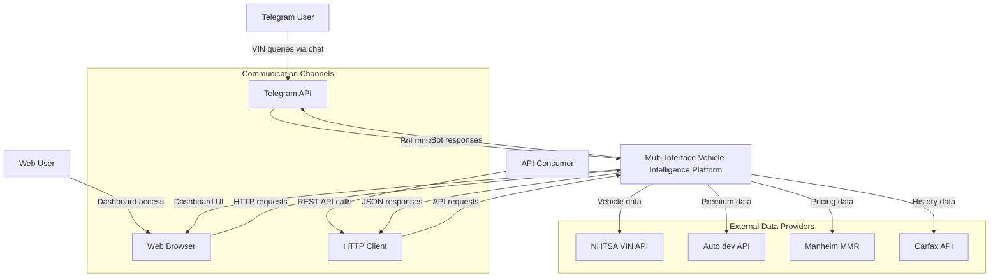
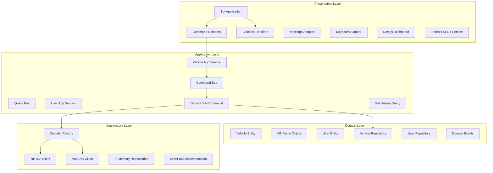
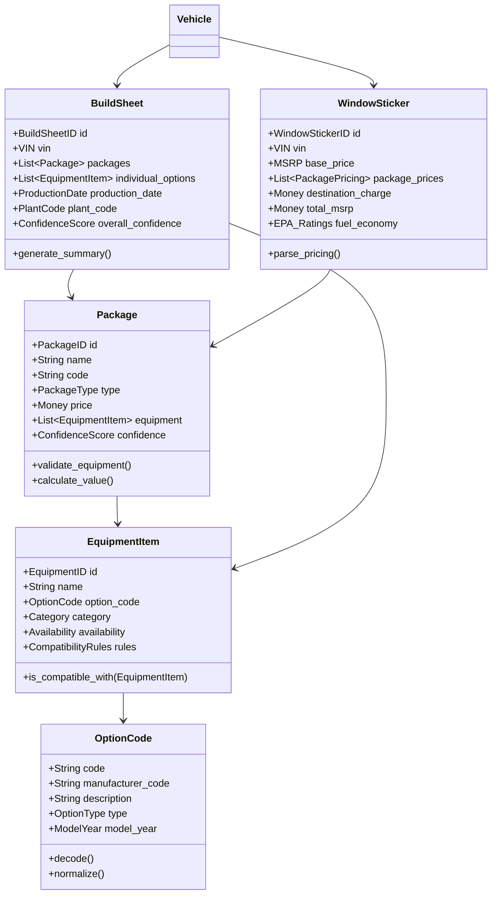
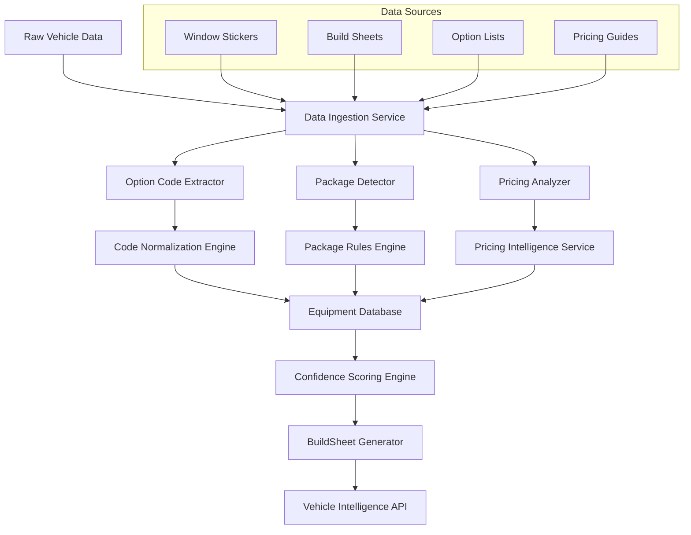
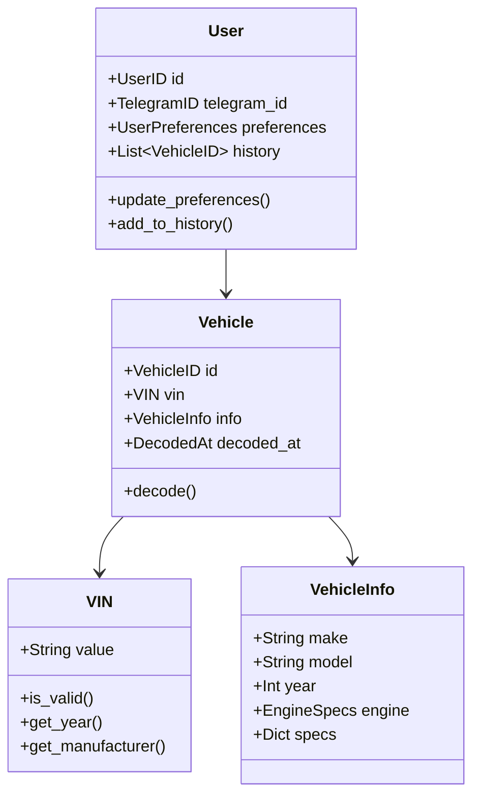
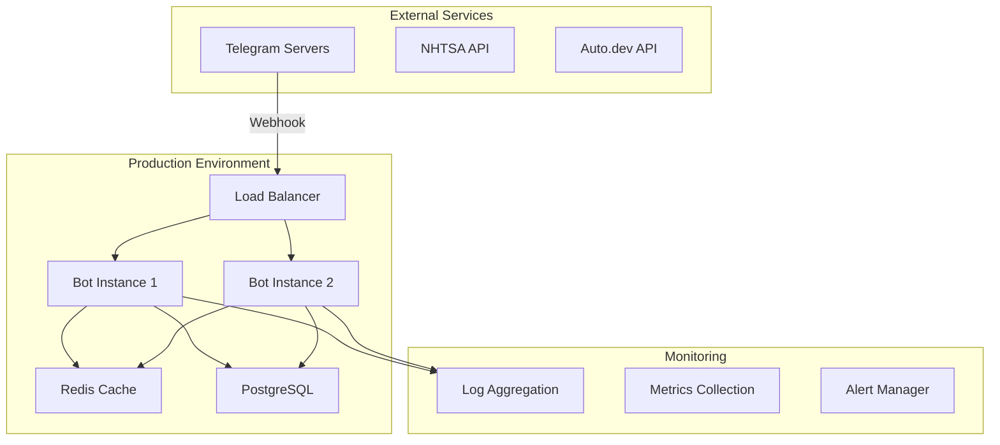
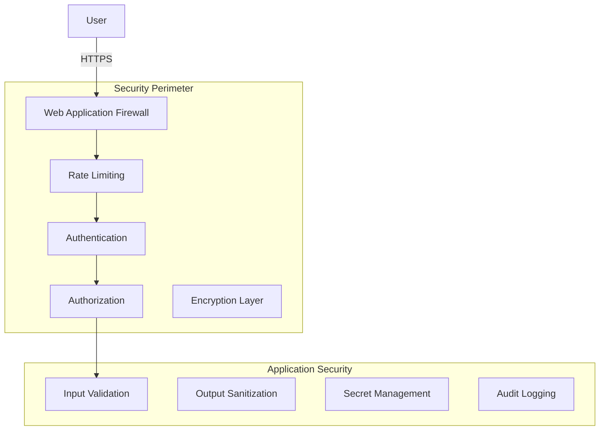

# Platform Architecture - Multi-Interface Vehicle Intelligence Platform

## 📚 Related Documentation
- **[📖 Main README](README.md)** - Platform overview and quick start guide
- **[🔗 API Documentation](docs/api/README.md)** - REST API reference and integration guides
- **[🔌 Integrations Guide](docs/integrations/README.md)** - Data sources and third-party integrations
- **[📋 Documentation Hub](docs/README.md)** - Complete documentation index
- **[🚀 Development Roadmap](FUTURE_PLANS.md)** - Strategic technology roadmap
- **[🏗️ Infrastructure Guide](INFRASTRUCTURE_GUIDE.md)** - Deployment and operations
- **[🧪 Testing Guide](README_TESTING.md)** - Quality assurance and testing strategies

## Table of Contents
1. [Executive Summary](#executive-summary)
2. [System Overview](#system-overview)
3. [Architectural Principles](#architectural-principles)
4. [Architecture Style](#architecture-style)
5. [System Context](#system-context)
6. [Container Architecture](#container-architecture)
7. [Component Architecture](#component-architecture)
8. [Package Intelligence Subsystem](#package-intelligence-subsystem)
9. [Data Architecture](#data-architecture)
10. [Infrastructure Architecture](#infrastructure-architecture)
11. [Security and Compliance](#security-and-compliance)
12. [Architecture Decision Records](#architecture-decision-records)
13. [Quality Attributes](#quality-attributes)
14. [Future Roadmap](#future-roadmap)

## Executive Summary

The Multi-Interface Vehicle Intelligence Platform is a comprehensive, microservices-ready system built using Domain-Driven Design (DDD) principles and Clean Architecture patterns. It provides vehicle information decoding and package intelligence services through multiple interfaces: Telegram Bot, Next.js Dashboard, and FastAPI REST services, integrating with various external data providers.

### Key Architectural Highlights
- **Multi-Interface Platform**: Unified backend serving Telegram Bot, Web Dashboard, and REST API
- **Domain-Driven Design**: Clear separation into bounded contexts (Vehicle, Package Intelligence, User, Messaging, Integrations)
- **Clean Architecture**: Layered architecture with dependency inversion
- **Event-Driven Communication**: Asynchronous message passing between components
- **Dependency Injection**: IoC container for flexible component wiring
- **Adapter Pattern**: External service integration through standardized interfaces
- **CQRS Pattern**: Command and Query separation for scalability
- **Package Intelligence**: Advanced vehicle option and equipment analysis

## System Overview

### Purpose
A comprehensive vehicle intelligence platform providing instant, accurate vehicle information and package intelligence through multiple user interfaces including conversational Telegram bot, web dashboard, and REST API services.

### Multi-Interface Platform
The platform serves users through three primary surfaces:
- **Telegram Bot**: Conversational interface for instant VIN decoding and vehicle queries
- **Next.js Dashboard**: Web-based management interface with advanced search and analytics
- **FastAPI REST**: Programmatic access for integrations and third-party applications

### Core Capabilities
- **Vehicle Intelligence**: Real-time VIN decoding from multiple data sources (NHTSA, Auto.dev)
- **Package Intelligence**: Advanced vehicle options, equipment, and build sheet analysis
- **Multi-Provider Integration**: Flexible service provider selection with fallback strategies
- **User Management**: Preference management, history tracking, and personalization
- **Rich Interfaces**: Conversational UI, web dashboard, and REST API access
- **Data Normalization**: Unified data models across different provider formats
- **Confidence Scoring**: Reliability assessment for decoded information

### Data Providers
- **NHTSA (National Highway Traffic Safety Administration)**: Free government VIN decoder
- **Auto.dev**: Premium automotive API with comprehensive vehicle data
- **Manheim MMR**: Market valuation and pricing data (future integration)
- **Carfax**: Vehicle history and accident reporting (future integration)

### Technical Stack

#### Backend
- **Language**: Python 3.9+
- **Framework**: python-telegram-bot (async)
- **Web Framework**: FastAPI (REST API)
- **Architecture**: DDD + Clean Architecture
- **DI Container**: dependency-injector
- **Database**: PostgreSQL (production), SQLite (development)
- **ORM**: SQLAlchemy
- **External APIs**: NHTSA, Auto.dev
- **Testing**: pytest, pytest-asyncio
- **Configuration**: pydantic-settings

#### Frontend (Web Dashboard)
- **Framework**: Next.js 15.4 (React 19)
- **Language**: TypeScript
- **UI Components**: shadcn/ui (Radix UI primitives)
- **Styling**: Tailwind CSS 3.4
- **State Management**: React hooks
- **Build Tool**: Next.js with Turbo
- **Package Manager**: npm

## Architectural Principles

### 1. Domain-Driven Design (DDD)
- **Bounded Contexts**: Clear domain boundaries (Vehicle Domain, Package Intelligence, User Management, Messaging, Integrations)
- **Ubiquitous Language**: Consistent terminology across code and documentation
- **Domain Events**: Event-driven communication between aggregates
- **Value Objects**: Immutable domain concepts (VIN, UserID, PackageID, OptionCode, etc.)

### 2. Clean Architecture (Hexagonal)
- **Dependency Inversion**: Core domain independent of external concerns
- **Ports and Adapters**: Clear interfaces for external integrations
- **Use Case Driven**: Application layer orchestrates business operations
- **Framework Independence**: Core logic decoupled from frameworks

### 3. SOLID Principles
- **Single Responsibility**: Each class has one reason to change
- **Open/Closed**: Open for extension, closed for modification
- **Liskov Substitution**: Implementations are interchangeable
- **Interface Segregation**: Small, focused interfaces
- **Dependency Inversion**: Depend on abstractions, not concretions

### 4. Event-Driven Architecture
- **Domain Events**: Business events trigger cross-aggregate communication
- **Event Bus**: Decoupled event publishing and subscription
- **Eventual Consistency**: Asynchronous updates across boundaries
- **Event Sourcing Ready**: Foundation for event sourcing if needed

## Architecture Style

### Layered Architecture

```
┌─────────────────────────────────────────────────────────────┐
│                    Presentation Layer                       │
│    (Telegram Bot, REST API, Next.js Dashboard, CLI)        │
├─────────────────────────────────────────────────────────────┤
│                    Application Layer                        │
│     (Use Cases, Command Handlers, Query Handlers)          │
├─────────────────────────────────────────────────────────────┤
│                      Domain Layer                           │
│    (Entities, Value Objects, Domain Services, Events)      │
├─────────────────────────────────────────────────────────────┤
│                   Infrastructure Layer                      │
│  (Repositories, External Services, Messaging, Persistence)  │
└─────────────────────────────────────────────────────────────┘
```

### Dependency Flow
- Dependencies point inward toward the domain
- Domain layer has no external dependencies
- Application layer depends only on domain
- Infrastructure and presentation depend on application and domain

## System Context

### C4 Model - Level 1: System Context



### External Systems
1. **Telegram Platform**: Conversational interface for instant vehicle queries
2. **Web Browser**: Dashboard interface for comprehensive vehicle management
3. **HTTP Clients**: Programmatic API access for integrations
4. **NHTSA API**: Free government VIN decoder service
5. **Auto.dev API**: Premium automotive data provider with comprehensive specifications
6. **Manheim MMR**: Market valuation and pricing intelligence (future)
7. **Carfax**: Vehicle history and accident reporting (future)

## Container Architecture

### C4 Model - Level 2: Container Diagram

```mermaid
graph TB
    subgraph "Multi-Interface Vehicle Intelligence Platform"
        subgraph "Interfaces"
            TelegramBot[Telegram Bot<br/>Python, AsyncIO]
            NextDashboard[Next.js Dashboard<br/>React 19, TypeScript]
            FastAPI[FastAPI REST Service<br/>Python, FastAPI]
        end
        
        subgraph "Core Services"
            VehicleService[Vehicle Domain Service<br/>Python, DDD]
            PackageService[Package Intelligence Service<br/>Python, ML]
            UserService[User Service<br/>Python, Auth]
            MessageService[Messaging Service<br/>Python, Events]
            IntegrationService[Integrations Service<br/>Python, Adapters]
        end
        
        subgraph "Data Layer"
            PostgreSQL[PostgreSQL Database<br/>Relational Storage]
            UpstashRedis[Upstash Redis<br/>Cache & Sessions]
            ObjectStorage[Object Storage<br/>Optional Files]
        end
    end
    
    subgraph "External Data Providers"
        NHTSA[NHTSA VIN API<br/>Government Data]
        AutoDev[Auto.dev API<br/>Premium Vehicle Data]
        ManheimMMR[Manheim MMR<br/>Market Valuation]
        Carfax[Carfax API<br/>Vehicle History]
    end
    
    subgraph "Communication Channels"
        TelegramAPI[Telegram API]
        WebBrowser[Web Browser]
        HTTPClients[HTTP Clients]
    end
    
    %% Interface connections
    TelegramBot <-->|Webhook/Polling| TelegramAPI
    NextDashboard <-->|HTTP/HTTPS| WebBrowser
    FastAPI <-->|REST API| HTTPClients
    
    %% Service interactions
    TelegramBot --> VehicleService
    TelegramBot --> UserService
    TelegramBot --> MessageService
    
    NextDashboard --> VehicleService
    NextDashboard --> PackageService
    NextDashboard --> UserService
    
    FastAPI --> VehicleService
    FastAPI --> PackageService
    FastAPI --> IntegrationService
    
    %% Data access
    VehicleService --> PostgreSQL
    PackageService --> PostgreSQL
    UserService --> PostgreSQL
    
    VehicleService --> UpstashRedis
    UserService --> UpstashRedis
    PackageService --> UpstashRedis
    
    PackageService -.->|Optional| ObjectStorage
    
    %% External integrations
    IntegrationService --> NHTSA
    IntegrationService --> AutoDev
    IntegrationService -.->|Future| ManheimMMR
    IntegrationService -.->|Future| Carfax
```



### Container Descriptions

#### Telegram Bot Application
- **Technology**: Python 3.9+, asyncio
- **Responsibility**: Core application logic and orchestration
- **Communication**: HTTPS REST/Webhook with Telegram

#### Web Dashboard (Next.js)
- **Technology**: Next.js 15.4, React 19, TypeScript
- **Responsibility**: Web-based vehicle management interface
- **Communication**: REST API calls to FastAPI backend
- **UI Framework**: shadcn/ui with Tailwind CSS
- **Features**: Real-time statistics, VIN decoding, search, vehicle management

#### REST API (FastAPI)
- **Technology**: FastAPI, SQLAlchemy
- **Responsibility**: HTTP API for web dashboard and external integrations
- **Communication**: JSON REST over HTTPS
- **Endpoints**: Vehicle CRUD, VIN decoding, statistics

#### Dependency Injection Container
- **Technology**: dependency-injector
- **Responsibility**: Component wiring and lifecycle management
- **Pattern**: Constructor injection

#### Database Layer
- **Technology**: PostgreSQL (production), SQLite (dev)
- **Responsibility**: Persistent storage for vehicles and users
- **ORM**: SQLAlchemy for database abstraction

#### In-Memory Cache
- **Technology**: Python collections
- **Responsibility**: Temporary storage for user sessions
- **Future**: Redis/Upstash for persistence

## Component Architecture

### C4 Model - Level 3: Component Diagram



### Key Components

#### Domain Layer Components
- **Vehicle Entity**: Core business object representing decoded vehicle
- **VIN Value Object**: Immutable VIN with validation
- **User Entity**: User preferences and history
- **Domain Services**: Business logic not fitting entities
- **Repository Interfaces**: Abstraction for data persistence

#### Application Layer Components
- **Command Handlers**: Execute business operations
- **Query Handlers**: Retrieve data without side effects
- **Application Services**: Orchestrate use cases
- **Command/Query Bus**: Message routing and handling
- **DTOs**: Data transfer between layers

#### Infrastructure Components
- **External Service Clients**: API integration implementations
- **Repository Implementations**: Concrete data access
- **Adapters**: Convert between external and domain models
- **Event Bus**: Concrete event publishing/subscription

#### Presentation Components

##### Telegram Bot Components
- **Bot Application**: Main Telegram bot orchestrator
- **Command Handlers**: Handle Telegram commands (/start, /vin)
- **Callback Handlers**: Handle inline keyboard interactions
- **Message Formatters**: Rich message composition
- **Keyboard Builders**: Dynamic UI generation

##### Web Dashboard Components (Next.js)
- **Page Components**: Server and client React components
- **UI Components**: shadcn/ui component library
- **API Client**: Fetch-based REST client for backend communication
- **State Management**: React hooks for local state
- **Table Component**: Paginated vehicle display with search
- **Dialog Components**: Modal interfaces for VIN decoding and details
- **Card Components**: Statistics and data visualization

##### REST API Components (FastAPI)
- **API Router**: HTTP endpoint routing and validation
- **Request Handlers**: Process HTTP requests and responses
- **CORS Middleware**: Cross-origin resource sharing configuration
- **Response Models**: Pydantic models for API responses
- **Error Handlers**: Standardized error responses

## Package Intelligence Subsystem

The Package Intelligence subsystem represents a sophisticated bounded context within the platform, focused on understanding and analyzing vehicle options, equipment packages, and build configurations beyond basic VIN decoding.

### Purpose
Provide comprehensive vehicle package analysis, option decoding, and equipment intelligence through advanced data processing and machine learning techniques.

### Domain Model Additions



### Core Capabilities

#### 1. Package Recognition and Analysis
- **Option Code Decoding**: Translate manufacturer-specific codes to human-readable descriptions
- **Package Detection**: Identify complete option packages from individual codes
- **Compatibility Validation**: Ensure option combinations are valid for specific model/year
- **Pricing Intelligence**: Calculate package values and MSRP impacts

#### 2. Ingestion and Normalization Flows



##### Ingestion Process
1. **Raw Data Collection**: Gather option codes, window stickers, and build sheets
2. **Code Extraction**: Parse manufacturer-specific option codes and descriptions
3. **Data Normalization**: Standardize format and terminology across manufacturers
4. **Package Detection**: Identify logical groupings and package relationships
5. **Validation**: Ensure data consistency and compatibility rules
6. **Confidence Scoring**: Assess reliability of each decoded element

##### Normalization Rules
- **Manufacturer Code Mapping**: Translate brand-specific codes to universal format
- **Description Standardization**: Consistent terminology and formatting
- **Category Classification**: Group options by type (safety, performance, comfort, etc.)
- **Compatibility Validation**: Ensure option combinations are production-valid

### 3. Confidence Scoring and Rules Engine

#### Confidence Scoring Algorithm
```python
class ConfidenceScoreCalculator:
    def calculate_package_confidence(self, package: Package) -> ConfidenceScore:
        factors = {
            'source_reliability': self._assess_data_source(),
            'code_match_accuracy': self._validate_option_codes(),
            'compatibility_check': self._verify_option_compatibility(),
            'pricing_consistency': self._validate_pricing_logic(),
            'historical_validation': self._check_production_records()
        }
        return self._weighted_average(factors)
```

#### Confidence Levels
- **High (90-100%)**: Multiple verified sources, all compatibility checks pass
- **Medium-High (75-89%)**: Primary source verified, minor compatibility questions
- **Medium (50-74%)**: Single source, some validation gaps
- **Low (25-49%)**: Incomplete data, significant validation concerns
- **Very Low (0-24%)**: Unverified or conflicting information

#### Rules Engine Components

##### Compatibility Rules
```typescript
interface CompatibilityRule {
  id: string;
  name: string;
  condition: OptionCondition;
  action: CompatibilityAction;
  priority: number;
}

type OptionCondition = 
  | { type: 'requires'; optionCodes: string[] }
  | { type: 'conflicts'; optionCodes: string[] }
  | { type: 'modelYear'; years: number[] }
  | { type: 'trimLevel'; trims: string[] };
```

##### Business Rules
- **Package Prerequisites**: Certain options require base packages
- **Mutual Exclusions**: Options that cannot coexist
- **Model Year Restrictions**: Options available only in specific years
- **Trim Level Dependencies**: Options tied to specific trim configurations
- **Production Plant Variations**: Regional or plant-specific option availability

### Technical Implementation

#### Application Services
```python
class PackageIntelligenceService:
    def __init__(self,
                 option_decoder: OptionCodeDecoder,
                 package_detector: PackageDetector,
                 confidence_engine: ConfidenceEngine,
                 rules_engine: RulesEngine):
        self._option_decoder = option_decoder
        self._package_detector = package_detector
        self._confidence_engine = confidence_engine
        self._rules_engine = rules_engine
    
    async def analyze_vehicle_options(self, vin: VIN, raw_data: dict) -> BuildSheet:
        # Extract and decode option codes
        option_codes = await self._option_decoder.extract_codes(raw_data)
        
        # Detect package groupings
        packages = await self._package_detector.identify_packages(option_codes)
        
        # Apply compatibility rules
        validated_packages = await self._rules_engine.validate_compatibility(packages)
        
        # Calculate confidence scores
        scored_packages = await self._confidence_engine.score_packages(validated_packages)
        
        # Generate build sheet
        return BuildSheet(
            vin=vin,
            packages=scored_packages,
            overall_confidence=self._calculate_overall_confidence(scored_packages)
        )
```

#### Data Integration
- **Source Adapters**: Normalize data from different providers (Auto.dev, manufacturer APIs)
- **Caching Strategy**: Redis-based caching for frequently accessed option definitions
- **Event Streaming**: Real-time updates when new option codes or packages are discovered
- **Machine Learning Integration**: Continuous improvement of package detection algorithms

### API Endpoints

```typescript
// Package Intelligence endpoints
GET    /api/packages                    // List known packages
GET    /api/packages/:id               // Get package details
POST   /api/decode-options             // Decode option codes
GET    /api/vehicles/:vin/build-sheet  // Get complete build sheet
GET    /api/vehicles/:vin/packages     // Get package analysis
POST   /api/validate-options           // Validate option compatibility

// Analysis endpoints  
POST   /api/analyze/window-sticker     // Analyze window sticker data
POST   /api/analyze/option-codes       // Bulk option code analysis
GET    /api/compatibility/:make/:model/:year  // Get compatibility rules
```

### Integration Points

#### With Vehicle Domain
- **VIN Association**: Link packages to specific vehicles
- **Specification Enhancement**: Enrich basic vehicle data with detailed options
- **Valuation Support**: Provide option values for pricing calculations

#### With External Providers
- **Auto.dev Integration**: Enhanced option data and package definitions
- **Manufacturer APIs**: Direct access to official option codes and build sheets
- **Aftermarket Data**: Third-party option and package information

#### With User Interfaces
- **Telegram Bot**: Conversational package explanations and summaries
- **Web Dashboard**: Visual package breakdown and option details
- **REST API**: Programmatic access to package intelligence data

### Future Enhancements

#### Phase 1: Foundation (Q1 2025)
- [ ] Core option code decoding engine
- [ ] Basic package detection algorithms
- [ ] Confidence scoring framework
- [ ] Initial compatibility rules

#### Phase 2: Intelligence (Q2 2025)
- [ ] Machine learning package detection
- [ ] Advanced pricing intelligence
- [ ] Window sticker parsing
- [ ] Build sheet generation

#### Phase 3: Advanced Features (Q3 2025)
- [ ] Visual package comparison tools
- [ ] Option recommendation engine
- [ ] Market analysis and trends
- [ ] Custom package builder

## Data Architecture

### Domain Model



### Data Flow Patterns

#### VIN Decode Flow
1. User sends VIN via Telegram message
2. Command handler validates and creates DecodeVIN command
3. Command bus routes to DecodeVINHandler
4. Handler uses DecoderFactory to select appropriate service
5. External service adapter fetches and transforms data
6. Vehicle entity created and persisted
7. VehicleDecoded event published
8. Response formatted and sent to user

#### User Settings Flow
1. User clicks settings button
2. Callback handler retrieves user preferences
3. Dynamic keyboard generated based on current state
4. User selection updates preferences
5. UserPreferencesUpdated event published
6. UI refreshed with new settings

### Persistence Strategy

#### Current Implementation
- **In-Memory Repositories**: Fast, simple, suitable for MVP
- **No external database**: Reduces complexity
- **Session-based storage**: Data lives for bot lifetime

#### Future Migration Path
1. **Phase 1**: Add Redis for session caching
2. **Phase 2**: PostgreSQL for persistent storage
3. **Phase 3**: Event sourcing for audit trail
4. **Phase 4**: Read model projections for queries

## Infrastructure Architecture

### Deployment Architecture



### Scalability Considerations

#### Horizontal Scaling
- Stateless bot instances
- Shared cache layer (Redis)
- Database connection pooling
- Load balancer distribution

#### Performance Optimization
- Response caching for repeated VINs
- Connection pooling for external APIs
- Async/await for concurrent operations
- Batch processing for bulk operations

### Monitoring and Observability

#### Logging Strategy
- Structured logging with context
- Log levels: DEBUG, INFO, WARNING, ERROR
- Correlation IDs for request tracing
- External service call logging

#### Metrics Collection
- Request/response times
- API call success rates
- Cache hit ratios
- Error rates by type

#### Health Checks
- Liveness probe: Bot connection status
- Readiness probe: External service availability
- Dependency health aggregation

## Web Dashboard Architecture

### Frontend Architecture (Next.js)

#### Technology Stack
- **Framework**: Next.js 15.4 with App Router
- **UI Library**: React 19 with TypeScript
- **Component Library**: shadcn/ui (built on Radix UI)
- **Styling**: Tailwind CSS 3.4 with custom design system
- **State Management**: React hooks (useState, useEffect)
- **Data Fetching**: Native fetch API with async/await

#### Component Structure
```
web-dashboard-next/
├── app/                      # Next.js App Router
│   ├── page.tsx             # Main dashboard page
│   ├── layout.tsx           # Root layout with metadata
│   └── globals.css          # Global styles and Tailwind
├── components/
│   └── ui/                  # shadcn/ui components
│       ├── button.tsx       # Button component
│       ├── card.tsx         # Card component
│       ├── dialog.tsx       # Modal dialog
│       ├── table.tsx        # Data table
│       ├── tabs.tsx         # Tab navigation
│       ├── input.tsx        # Form inputs
│       └── badge.tsx        # Status badges
├── lib/
│   └── utils.ts            # Utility functions (cn)
└── public/                  # Static assets
```

#### Key Features
1. **Real-time Statistics Dashboard**
   - Total vehicles card
   - Unique manufacturers count
   - Recent decodes (24h) tracking

2. **Vehicle Management Table**
   - Paginated data display
   - Search/filter functionality
   - Sort by columns
   - Inline actions (view, delete)

3. **VIN Decoding Interface**
   - Modal-based input form
   - Real-time validation
   - Error handling with user feedback
   - Success notifications

4. **Vehicle Details View**
   - Tabbed interface (Basic, Technical, Raw Data)
   - Comprehensive information display
   - JSON data viewer for raw responses

#### Design System
- **Color Palette**: Purple to pink gradient theme
- **Typography**: System font stack with fallbacks
- **Spacing**: Consistent 4px grid system
- **Components**: Modern card-based layout
- **Responsive**: Mobile-first responsive design
- **Dark Mode**: CSS variables for theme switching (ready)

#### Performance Optimizations
- **Server Components**: Default for static content
- **Client Components**: Only for interactive features
- **Code Splitting**: Automatic per-route splitting
- **Image Optimization**: Next.js Image component
- **Font Optimization**: System fonts for performance

### API Integration

#### REST API Endpoints
```typescript
// Vehicle endpoints
GET    /api/vehicles         // List vehicles (paginated)
GET    /api/vehicles/:id     // Get single vehicle
POST   /api/decode           // Decode new VIN
DELETE /api/vehicles/:id     // Delete vehicle
GET    /api/stats           // Dashboard statistics

// Health checks
GET    /health              // Service health status
```

#### Data Models
```typescript
interface Vehicle {
  id: number
  vin: string
  manufacturer: string
  model: string
  year: number
  vehicle_type: string
  engine_info: string
  fuel_type: string
  decoded_at: string
  user_id: number
  raw_data: any
}

interface Stats {
  total_vehicles: number
  unique_manufacturers: number
  recent_decodes: number
}
```

### Deployment Architecture

#### Development Setup
```bash
# Install dependencies
cd src/presentation/web-dashboard-next
npm install

# Run development server
npm run dev  # Runs on http://localhost:3000
```

#### Production Build
```bash
# Build for production
npm run build

# Start production server
npm start
```

#### Docker Deployment
```dockerfile
FROM node:20-alpine
WORKDIR /app
COPY package*.json ./
RUN npm ci --only=production
COPY . .
RUN npm run build
EXPOSE 3000
CMD ["npm", "start"]
```

### Migration from Legacy Dashboard

#### Legacy Stack (Deprecated)
- Vanilla JavaScript with jQuery-like patterns
- Server-side HTML templates
- CSS with custom styles
- FastAPI template rendering

#### New Stack (Current)
- React with TypeScript
- shadcn/ui component library
- Tailwind CSS utility-first styling
- Next.js with API routes
- Server and Client components

#### Migration Benefits
- **Type Safety**: Full TypeScript support
- **Component Reusability**: Modular UI components
- **Better UX**: Smoother interactions and loading states
- **Modern Tooling**: Hot reload, fast refresh, better DX
- **Performance**: Optimized bundle sizes and loading
- **Maintainability**: Clear component structure

## Security and Compliance

The platform implements comprehensive security measures across all interfaces and services, ensuring data protection, user privacy, and regulatory compliance.

### Security Architecture



### Authentication and Authorization

#### Multi-Interface Authentication
- **Telegram Bot**: User verification via Telegram ID with session management
- **Web Dashboard**: Session-based authentication with secure cookies
- **REST API**: API key authentication with JWT tokens for authorized clients

#### Authorization Framework
- **Role-Based Access Control (RBAC)**: User, Admin, API Consumer roles
- **Resource-Level Permissions**: Fine-grained access to vehicles, packages, and analytics
- **Multi-Tenant Isolation**: Secure data separation between users
- **Audit Trail**: Complete access logging for compliance

```python
class AuthorizationService:
    def authorize_vehicle_access(self, user: User, vehicle_id: VehicleID) -> bool:
        # Ensure users can only access their own vehicles
        return self._vehicle_repo.is_owned_by_user(vehicle_id, user.id)
    
    def authorize_api_access(self, api_key: APIKey, resource: Resource) -> bool:
        # Validate API key permissions and rate limits
        return self._api_key_service.has_permission(api_key, resource)
```

### Rate Limiting and Abuse Prevention

#### Multi-Level Rate Limiting
- **Global Platform Limits**: Overall system protection
- **Per-Interface Limits**: Specific limits for Telegram, Web, API
- **Per-User Limits**: Individual user quotas
- **Per-API-Key Limits**: Client-specific rate limiting

#### Implementation Strategy
```typescript
// Rate limiting configuration
interface RateLimitConfig {
  telegram: {
    messagesPerMinute: 30,
    vinDecodesPerHour: 50,
    dailyLimit: 200
  },
  webDashboard: {
    requestsPerMinute: 100,
    vinDecodesPerHour: 100
  },
  restAPI: {
    requestsPerMinute: 1000,  // Per API key
    vinDecodesPerHour: 500,
    monthlyQuota: 10000
  }
}
```

#### Abuse Detection
- **Pattern Recognition**: Identify suspicious usage patterns
- **IP-Based Blocking**: Temporary blocks for malicious IPs
- **Captcha Integration**: Human verification for suspicious activities
- **Progressive Penalties**: Escalating restrictions for repeat offenders

### Data Protection and Privacy

#### Privacy by Design
- **Data Minimization**: Only collect necessary information
- **Purpose Limitation**: Use data only for specified purposes
- **Storage Limitation**: Automatic data retention policies
- **Anonymization**: Optional VIN and user data anonymization

#### PII Handling
```python
class PrivacyService:
    def anonymize_vin(self, vin: VIN) -> AnonymizedVIN:
        # Replace specific digits with generic markers
        return AnonymizedVIN(self._hash_last_6_digits(vin.value))
    
    def handle_deletion_request(self, user_id: UserID) -> None:
        # GDPR Article 17 - Right to Erasure
        self._user_service.delete_user_data(user_id)
        self._vehicle_service.anonymize_user_vehicles(user_id)
        self._audit_service.log_deletion(user_id)
```

#### Data Classification
- **Public**: VIN decode specifications (NHTSA data)
- **Internal**: System logs, performance metrics
- **Confidential**: User preferences, API keys
- **Restricted**: Personal identifiers, usage analytics

### Security Controls

#### Input Validation and Sanitization
- **VIN Validation**: Strict 17-character format validation
- **SQL Injection Prevention**: Parameterized queries only
- **XSS Protection**: Input sanitization and CSP headers
- **Command Injection**: Input validation for system interactions

#### Encryption and Transport Security
- **TLS 1.3**: All external communications
- **Certificate Pinning**: Mobile and web client security
- **API Key Encryption**: Secure storage of sensitive credentials
- **Database Encryption**: At-rest encryption for sensitive data

#### Secret Management
```yaml
# Production secret management
secrets:
  telegram_bot_token:
    source: environment_variable
    rotation: 90_days
  
  database_credentials:
    source: vault_service
    rotation: 30_days
  
  external_api_keys:
    source: encrypted_config
    rotation: 180_days
```

### Audit Trails and Monitoring

#### Comprehensive Logging
- **Authentication Events**: Login attempts, token usage
- **Authorization Decisions**: Access grants and denials
- **Data Access**: Vehicle lookups, package analysis
- **System Events**: Errors, performance anomalies

#### Audit Log Schema
```typescript
interface AuditLogEntry {
  timestamp: DateTime;
  eventType: 'auth' | 'access' | 'modification' | 'error';
  userId?: string;
  apiKey?: string;
  resource: string;
  action: string;
  result: 'success' | 'failure';
  metadata: {
    ipAddress: string;
    userAgent?: string;
    requestId: string;
  };
}
```

#### Security Monitoring
- **Real-time Alerting**: Suspicious activity detection
- **Anomaly Detection**: Unusual usage patterns
- **Compliance Reporting**: Automated regulatory reports
- **Incident Response**: Automated security incident handling

### Compliance Framework

#### GDPR Compliance (European Union)
- **Article 6**: Lawful basis for processing (legitimate interest)
- **Article 13**: Information to be provided (privacy notices)
- **Article 17**: Right to erasure ("right to be forgotten")
- **Article 20**: Right to data portability
- **Article 25**: Data protection by design and by default
- **Article 32**: Security of processing

#### CCPA Compliance (California)
- **Right to Know**: Data collection and usage transparency
- **Right to Delete**: User data deletion upon request
- **Right to Opt-Out**: Third-party data sharing controls
- **Non-Discrimination**: Equal service regardless of privacy choices

#### Automotive Industry Standards
- **ISO/SAE 21434**: Cybersecurity engineering for road vehicles
- **UNECE WP.29**: Vehicle cybersecurity and software update regulations
- **NHTSA Guidelines**: Federal motor vehicle safety standards
- **Privacy4Cars Standards**: Automotive data privacy best practices

### Implementation Roadmap

#### Phase 1: Foundation Security (Q1 2025)
- [ ] Basic authentication and authorization
- [ ] Rate limiting implementation
- [ ] Input validation framework
- [ ] Audit logging system

#### Phase 2: Advanced Security (Q2 2025)
- [ ] Multi-factor authentication
- [ ] Advanced anomaly detection
- [ ] Compliance automation
- [ ] Security incident response

#### Phase 3: Enterprise Security (Q3 2025)
- [ ] Single sign-on (SSO) integration
- [ ] Advanced threat protection
- [ ] Security assessment automation
- [ ] Third-party security certifications

### Security Testing and Validation

#### Continuous Security Assessment
- **Automated Security Scanning**: SAST/DAST integration in CI/CD
- **Penetration Testing**: Quarterly external security assessments
- **Dependency Scanning**: Automated vulnerability detection
- **Compliance Audits**: Annual third-party compliance verification

#### Security Metrics
- **Mean Time to Detection (MTTD)**: < 5 minutes for critical events
- **Mean Time to Response (MTTR)**: < 30 minutes for security incidents
- **Authentication Success Rate**: > 99.9% for legitimate users
- **False Positive Rate**: < 1% for security alerts

## Architecture Decision Records

### ADR-001: Domain-Driven Design Adoption
**Status**: Accepted  
**Context**: Need clear separation of business logic  
**Decision**: Implement DDD with bounded contexts  
**Consequences**: Higher initial complexity, better maintainability  

### ADR-002: Clean Architecture Layers
**Status**: Accepted  
**Context**: Require flexibility for future changes  
**Decision**: Implement hexagonal architecture with clear layers  
**Consequences**: More boilerplate, better testability  

### ADR-003: Dependency Injection Container
**Status**: Accepted  
**Context**: Need flexible component wiring  
**Decision**: Use dependency-injector library  
**Consequences**: Runtime overhead, improved modularity  

### ADR-004: In-Memory Storage Initially
**Status**: Accepted  
**Context**: MVP needs quick deployment  
**Decision**: Start with in-memory, migrate later  
**Consequences**: Data loss on restart, simple deployment  

### ADR-005: CQRS Pattern Implementation
**Status**: Accepted  
**Context**: Different read/write patterns  
**Decision**: Separate commands and queries  
**Consequences**: More classes, clearer intent  

### ADR-006: Event-Driven Communication
**Status**: Accepted  
**Context**: Need loose coupling between components  
**Decision**: Implement domain events and event bus  
**Consequences**: Async complexity, better scalability  

## Quality Attributes

### Performance Requirements
- **Response Time**: < 2 seconds for VIN decode
- **Throughput**: 100 requests/minute per instance
- **Concurrency**: 50 simultaneous users
- **Cache Hit Ratio**: > 30% for common VINs

### Reliability Requirements
- **Availability**: 99.9% uptime
- **Error Rate**: < 1% failed requests
- **Recovery Time**: < 5 minutes
- **Data Consistency**: Eventual consistency

### Scalability Requirements
- **Horizontal Scaling**: Support multiple instances
- **Load Distribution**: Even request distribution
- **Database Scaling**: Read replicas support
- **Cache Scaling**: Distributed caching ready

### Maintainability Requirements
- **Code Coverage**: > 80% test coverage
- **Documentation**: Comprehensive inline docs
- **Modularity**: Loosely coupled components
- **Debugging**: Structured logging and tracing

### Security Requirements
- **Authentication**: Telegram user verification
- **Authorization**: User-specific data access
- **Encryption**: TLS for all external communication
- **Audit**: Security event logging

## Future Roadmap

### Phase 1: Foundation Enhancement (Current)
- ✅ DDD implementation
- ✅ Clean architecture
- ✅ Basic VIN decoding
- ✅ Telegram integration
- ⏳ Comprehensive testing
- ⏳ Documentation completion

### Phase 2: Persistence Layer (Q1 2025)
- [ ] Redis integration for caching
- [ ] PostgreSQL for data persistence
- [ ] Migration scripts
- [ ] Backup strategies
- [ ] Data retention policies

### Phase 3: Advanced Features (Q2 2025)
- [ ] Vehicle history tracking
- [ ] Price estimation service
- [ ] Recall information
- [ ] Maintenance schedules
- [ ] Multi-language support

### Phase 4: Enterprise Features (Q3 2025)
- [ ] REST API endpoint
- [ ] Webhook support
- [ ] Batch processing
- [ ] Analytics dashboard
- [ ] White-label solution

### Phase 5: AI Enhancement (Q4 2025)
- [ ] Natural language processing
- [ ] Predictive maintenance
- [ ] Image-based VIN detection
- [ ] Conversational AI
- [ ] Recommendation engine

## Appendices

### A. Technology Decisions
- **Python 3.9+**: Modern async support, type hints
- **python-telegram-bot**: Mature, async-first library
- **dependency-injector**: Powerful DI with good Python integration
- **pydantic**: Data validation and settings management
- **pytest**: Comprehensive testing framework

### B. Development Practices
- **Git Flow**: Feature branches, PR reviews
- **Semantic Versioning**: Clear version management
- **Continuous Integration**: Automated testing
- **Code Review**: Mandatory peer review
- **Documentation**: Code-as-documentation approach

### C. Operational Procedures
- **Deployment**: Blue-green deployment strategy
- **Monitoring**: Proactive alerting
- **Incident Response**: Defined escalation paths
- **Backup**: Regular data backups
- **Disaster Recovery**: RTO < 1 hour

### D. References
- [Domain-Driven Design - Eric Evans](https://www.domainlanguage.com/ddd/)
- [Clean Architecture - Robert C. Martin](https://blog.cleancoder.com/uncle-bob/2012/08/13/the-clean-architecture.html)
- [C4 Model - Simon Brown](https://c4model.com/)
- [python-telegram-bot Documentation](https://python-telegram-bot.readthedocs.io/)
- [Dependency Injector Documentation](https://python-dependency-injector.ets-labs.org/)

---

*Last Updated: January 2025*  
*Version: 1.0.0*  
*Maintainer: Engineering Team*