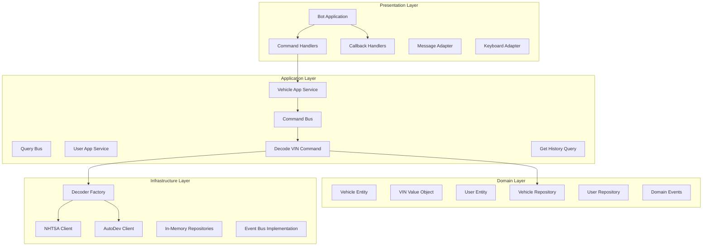

# Architecture Documentation - VIN Decoder Telegram Bot

## Table of Contents
1. [Executive Summary](#executive-summary)
2. [System Overview](#system-overview)
3. [Architectural Principles](#architectural-principles)
4. [Architecture Style](#architecture-style)
5. [System Context](#system-context)
6. [Container Architecture](#container-architecture)
7. [Component Architecture](#component-architecture)
8. [Data Architecture](#data-architecture)
9. [Infrastructure Architecture](#infrastructure-architecture)
10. [Security Architecture](#security-architecture)
11. [Architecture Decision Records](#architecture-decision-records)
12. [Quality Attributes](#quality-attributes)
13. [Future Roadmap](#future-roadmap)

## Executive Summary

The VIN Decoder Telegram Bot is a modern, microservices-ready application built using Domain-Driven Design (DDD) principles and Clean Architecture patterns. It provides vehicle information decoding services through a conversational Telegram interface, integrating with multiple external VIN decoder APIs.

### Key Architectural Highlights
- **Domain-Driven Design**: Clear separation of business logic into bounded contexts
- **Clean Architecture**: Layered architecture with dependency inversion
- **Event-Driven Communication**: Asynchronous message passing between components
- **Dependency Injection**: IoC container for flexible component wiring
- **Adapter Pattern**: External service integration through standardized interfaces
- **CQRS Pattern**: Command and Query separation for scalability

## System Overview

### Purpose
Provide instant, accurate vehicle information through VIN decoding via a user-friendly Telegram bot interface.

### Core Capabilities
- Real-time VIN decoding from multiple data sources
- User preference management and history tracking
- Rich conversational interface with inline keyboards
- Flexible service provider selection (NHTSA, Auto.dev)
- Comprehensive vehicle specification reporting

### Technical Stack
- **Language**: Python 3.9+
- **Framework**: python-telegram-bot (async)
- **Architecture**: DDD + Clean Architecture
- **DI Container**: dependency-injector
- **External APIs**: NHTSA, Auto.dev
- **Testing**: pytest, pytest-asyncio
- **Configuration**: pydantic-settings

## Architectural Principles

### 1. Domain-Driven Design (DDD)
- **Bounded Contexts**: Clear domain boundaries (Vehicle, User, Messaging, Integration)
- **Ubiquitous Language**: Consistent terminology across code and documentation
- **Domain Events**: Event-driven communication between aggregates
- **Value Objects**: Immutable domain concepts (VIN, UserID, etc.)

### 2. Clean Architecture (Hexagonal)
- **Dependency Inversion**: Core domain independent of external concerns
- **Ports and Adapters**: Clear interfaces for external integrations
- **Use Case Driven**: Application layer orchestrates business operations
- **Framework Independence**: Core logic decoupled from frameworks

### 3. SOLID Principles
- **Single Responsibility**: Each class has one reason to change
- **Open/Closed**: Open for extension, closed for modification
- **Liskov Substitution**: Implementations are interchangeable
- **Interface Segregation**: Small, focused interfaces
- **Dependency Inversion**: Depend on abstractions, not concretions

### 4. Event-Driven Architecture
- **Domain Events**: Business events trigger cross-aggregate communication
- **Event Bus**: Decoupled event publishing and subscription
- **Eventual Consistency**: Asynchronous updates across boundaries
- **Event Sourcing Ready**: Foundation for event sourcing if needed

## Architecture Style

### Layered Architecture

```
┌─────────────────────────────────────────────────────────────┐
│                    Presentation Layer                       │
│         (Telegram Bot, REST API, CLI, Web UI)              │
├─────────────────────────────────────────────────────────────┤
│                    Application Layer                        │
│     (Use Cases, Command Handlers, Query Handlers)          │
├─────────────────────────────────────────────────────────────┤
│                      Domain Layer                           │
│    (Entities, Value Objects, Domain Services, Events)      │
├─────────────────────────────────────────────────────────────┤
│                   Infrastructure Layer                      │
│  (Repositories, External Services, Messaging, Persistence)  │
└─────────────────────────────────────────────────────────────┘
```

### Dependency Flow
- Dependencies point inward toward the domain
- Domain layer has no external dependencies
- Application layer depends only on domain
- Infrastructure and presentation depend on application and domain

## System Context

### C4 Model - Level 1: System Context


### External Systems
1. **Telegram Platform**: Message delivery and user interaction
2. **NHTSA API**: Free government VIN decoder service
3. **Auto.dev API**: Premium vehicle data provider
4. **Future**: Analytics, monitoring, payment systems

## Container Architecture

### C4 Model - Level 2: Container Diagram


### Container Descriptions

#### Telegram Bot Application
- **Technology**: Python 3.9+, asyncio
- **Responsibility**: Core application logic and orchestration
- **Communication**: HTTPS REST/Webhook with Telegram

#### Dependency Injection Container
- **Technology**: dependency-injector
- **Responsibility**: Component wiring and lifecycle management
- **Pattern**: Constructor injection

#### In-Memory Cache
- **Technology**: Python collections
- **Responsibility**: Temporary storage for user sessions
- **Future**: Redis/Upstash for persistence

## Component Architecture

### C4 Model - Level 3: Component Diagram



### Key Components

#### Domain Layer Components
- **Vehicle Entity**: Core business object representing decoded vehicle
- **VIN Value Object**: Immutable VIN with validation
- **User Entity**: User preferences and history
- **Domain Services**: Business logic not fitting entities
- **Repository Interfaces**: Abstraction for data persistence

#### Application Layer Components
- **Command Handlers**: Execute business operations
- **Query Handlers**: Retrieve data without side effects
- **Application Services**: Orchestrate use cases
- **Command/Query Bus**: Message routing and handling
- **DTOs**: Data transfer between layers

#### Infrastructure Components
- **External Service Clients**: API integration implementations
- **Repository Implementations**: Concrete data access
- **Adapters**: Convert between external and domain models
- **Event Bus**: Concrete event publishing/subscription

#### Presentation Components
- **Bot Application**: Main Telegram bot orchestrator
- **Command Handlers**: Handle Telegram commands (/start, /vin)
- **Callback Handlers**: Handle inline keyboard interactions
- **Message Formatters**: Rich message composition
- **Keyboard Builders**: Dynamic UI generation

## Data Architecture

### Domain Model


### Data Flow Patterns

#### VIN Decode Flow
1. User sends VIN via Telegram message
2. Command handler validates and creates DecodeVIN command
3. Command bus routes to DecodeVINHandler
4. Handler uses DecoderFactory to select appropriate service
5. External service adapter fetches and transforms data
6. Vehicle entity created and persisted
7. VehicleDecoded event published
8. Response formatted and sent to user

#### User Settings Flow
1. User clicks settings button
2. Callback handler retrieves user preferences
3. Dynamic keyboard generated based on current state
4. User selection updates preferences
5. UserPreferencesUpdated event published
6. UI refreshed with new settings

### Persistence Strategy

#### Current Implementation
- **In-Memory Repositories**: Fast, simple, suitable for MVP
- **No external database**: Reduces complexity
- **Session-based storage**: Data lives for bot lifetime

#### Future Migration Path
1. **Phase 1**: Add Redis for session caching
2. **Phase 2**: PostgreSQL for persistent storage
3. **Phase 3**: Event sourcing for audit trail
4. **Phase 4**: Read model projections for queries

## Infrastructure Architecture

### Deployment Architecture


### Scalability Considerations

#### Horizontal Scaling
- Stateless bot instances
- Shared cache layer (Redis)
- Database connection pooling
- Load balancer distribution

#### Performance Optimization
- Response caching for repeated VINs
- Connection pooling for external APIs
- Async/await for concurrent operations
- Batch processing for bulk operations

### Monitoring and Observability

#### Logging Strategy
- Structured logging with context
- Log levels: DEBUG, INFO, WARNING, ERROR
- Correlation IDs for request tracing
- External service call logging

#### Metrics Collection
- Request/response times
- API call success rates
- Cache hit ratios
- Error rates by type

#### Health Checks
- Liveness probe: Bot connection status
- Readiness probe: External service availability
- Dependency health aggregation

## Security Architecture

### Security Layers


### Security Measures

#### API Security
- **Token Management**: Secure storage of API keys
- **Rate Limiting**: Prevent API abuse
- **Request Validation**: Input sanitization
- **HTTPS Only**: Encrypted communication

#### Data Protection
- **PII Handling**: No persistent storage of personal data
- **VIN Privacy**: Optional anonymization
- **User Isolation**: Tenant data separation
- **Audit Trail**: Security event logging

#### Telegram Security
- **Bot Token**: Environment variable storage
- **User Verification**: Telegram ID validation
- **Command Injection**: Input sanitization
- **Message Limits**: Prevent spam/abuse

### Compliance Considerations
- GDPR: Right to erasure, data minimization
- CCPA: User data transparency
- Industry: Automotive data standards
- Platform: Telegram bot guidelines

## Architecture Decision Records

### ADR-001: Domain-Driven Design Adoption
**Status**: Accepted  
**Context**: Need clear separation of business logic  
**Decision**: Implement DDD with bounded contexts  
**Consequences**: Higher initial complexity, better maintainability  

### ADR-002: Clean Architecture Layers
**Status**: Accepted  
**Context**: Require flexibility for future changes  
**Decision**: Implement hexagonal architecture with clear layers  
**Consequences**: More boilerplate, better testability  

### ADR-003: Dependency Injection Container
**Status**: Accepted  
**Context**: Need flexible component wiring  
**Decision**: Use dependency-injector library  
**Consequences**: Runtime overhead, improved modularity  

### ADR-004: In-Memory Storage Initially
**Status**: Accepted  
**Context**: MVP needs quick deployment  
**Decision**: Start with in-memory, migrate later  
**Consequences**: Data loss on restart, simple deployment  

### ADR-005: CQRS Pattern Implementation
**Status**: Accepted  
**Context**: Different read/write patterns  
**Decision**: Separate commands and queries  
**Consequences**: More classes, clearer intent  

### ADR-006: Event-Driven Communication
**Status**: Accepted  
**Context**: Need loose coupling between components  
**Decision**: Implement domain events and event bus  
**Consequences**: Async complexity, better scalability  

## Quality Attributes

### Performance Requirements
- **Response Time**: < 2 seconds for VIN decode
- **Throughput**: 100 requests/minute per instance
- **Concurrency**: 50 simultaneous users
- **Cache Hit Ratio**: > 30% for common VINs

### Reliability Requirements
- **Availability**: 99.9% uptime
- **Error Rate**: < 1% failed requests
- **Recovery Time**: < 5 minutes
- **Data Consistency**: Eventual consistency

### Scalability Requirements
- **Horizontal Scaling**: Support multiple instances
- **Load Distribution**: Even request distribution
- **Database Scaling**: Read replicas support
- **Cache Scaling**: Distributed caching ready

### Maintainability Requirements
- **Code Coverage**: > 80% test coverage
- **Documentation**: Comprehensive inline docs
- **Modularity**: Loosely coupled components
- **Debugging**: Structured logging and tracing

### Security Requirements
- **Authentication**: Telegram user verification
- **Authorization**: User-specific data access
- **Encryption**: TLS for all external communication
- **Audit**: Security event logging

## Future Roadmap

### Phase 1: Foundation Enhancement (Current)
- ✅ DDD implementation
- ✅ Clean architecture
- ✅ Basic VIN decoding
- ✅ Telegram integration
- ⏳ Comprehensive testing
- ⏳ Documentation completion

### Phase 2: Persistence Layer (Q1 2025)
- [ ] Redis integration for caching
- [ ] PostgreSQL for data persistence
- [ ] Migration scripts
- [ ] Backup strategies
- [ ] Data retention policies

### Phase 3: Advanced Features (Q2 2025)
- [ ] Vehicle history tracking
- [ ] Price estimation service
- [ ] Recall information
- [ ] Maintenance schedules
- [ ] Multi-language support

### Phase 4: Enterprise Features (Q3 2025)
- [ ] REST API endpoint
- [ ] Webhook support
- [ ] Batch processing
- [ ] Analytics dashboard
- [ ] White-label solution

### Phase 5: AI Enhancement (Q4 2025)
- [ ] Natural language processing
- [ ] Predictive maintenance
- [ ] Image-based VIN detection
- [ ] Conversational AI
- [ ] Recommendation engine

## Appendices

### A. Technology Decisions
- **Python 3.9+**: Modern async support, type hints
- **python-telegram-bot**: Mature, async-first library
- **dependency-injector**: Powerful DI with good Python integration
- **pydantic**: Data validation and settings management
- **pytest**: Comprehensive testing framework

### B. Development Practices
- **Git Flow**: Feature branches, PR reviews
- **Semantic Versioning**: Clear version management
- **Continuous Integration**: Automated testing
- **Code Review**: Mandatory peer review
- **Documentation**: Code-as-documentation approach

### C. Operational Procedures
- **Deployment**: Blue-green deployment strategy
- **Monitoring**: Proactive alerting
- **Incident Response**: Defined escalation paths
- **Backup**: Regular data backups
- **Disaster Recovery**: RTO < 1 hour

### D. References
- [Domain-Driven Design - Eric Evans](https://www.domainlanguage.com/ddd/)
- [Clean Architecture - Robert C. Martin](https://blog.cleancoder.com/uncle-bob/2012/08/13/the-clean-architecture.html)
- [C4 Model - Simon Brown](https://c4model.com/)
- [python-telegram-bot Documentation](https://python-telegram-bot.readthedocs.io/)
- [Dependency Injector Documentation](https://python-dependency-injector.ets-labs.org/)

---

*Last Updated: January 2025*  
*Version: 1.0.0*  
*Maintainer: Engineering Team*