# C4 Model Diagrams - VIN Decoder Bot

## Overview
This document contains detailed C4 model diagrams for the VIN Decoder Bot system, following Simon Brown's C4 model methodology. The diagrams are provided in multiple formats: Mermaid (for GitHub rendering), PlantUML (for detailed diagrams), and Structurizr DSL (for interactive exploration).

## Level 1: System Context

### Purpose
Shows the VIN Decoder Bot system in context with its users and external systems.

### Mermaid Diagram
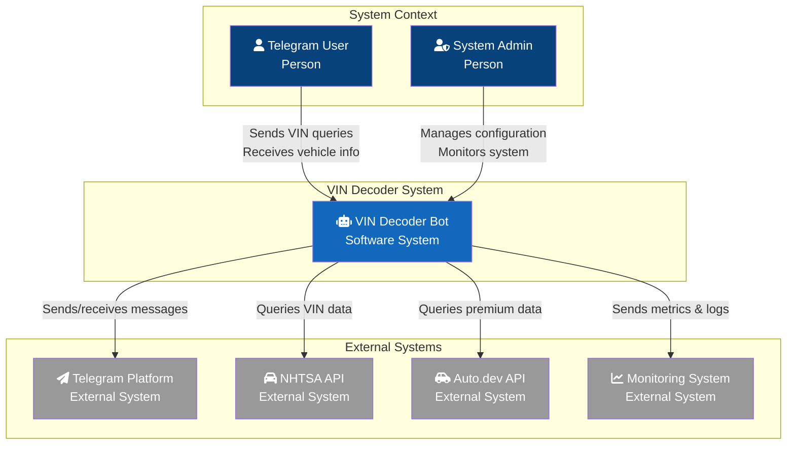

### PlantUML Diagram
```plantuml
@startuml C4_Context
!include https://raw.githubusercontent.com/plantuml-stdlib/C4-PlantUML/master/C4_Context.puml

title System Context - VIN Decoder Bot

Person(user, "Telegram User", "Vehicle owner or enthusiast querying VIN information")
Person(admin, "System Admin", "Manages bot configuration and monitors health")

System(vinbot, "VIN Decoder Bot", "Provides vehicle information through VIN decoding via Telegram interface")

System_Ext(telegram, "Telegram Platform", "Messaging platform for bot interaction")
System_Ext(nhtsa, "NHTSA API", "Free government VIN decoder service")
System_Ext(autodev, "Auto.dev API", "Premium vehicle data provider")
System_Ext(monitoring, "Monitoring System", "Logs, metrics, and alerting")

Rel(user, vinbot, "Sends VIN queries", "Telegram Messages")
Rel(vinbot, user, "Returns vehicle info", "Telegram Messages")
Rel(admin, vinbot, "Manages", "SSH/Config")
Rel(vinbot, telegram, "Uses", "Bot API/HTTPS")
Rel(vinbot, nhtsa, "Queries", "REST/HTTPS")
Rel(vinbot, autodev, "Queries", "REST/HTTPS")
Rel(vinbot, monitoring, "Sends", "Logs/Metrics")

@enduml
```

### Key Relationships
- **Users → Bot**: Natural language VIN queries via Telegram
- **Bot → External APIs**: RESTful API calls for VIN decoding
- **Bot → Telegram**: Bot API for message handling
- **Bot → Monitoring**: Observability data streaming

## Level 2: Container Diagram

### Purpose
Shows the high-level technology choices and how containers communicate.

### Mermaid Diagram
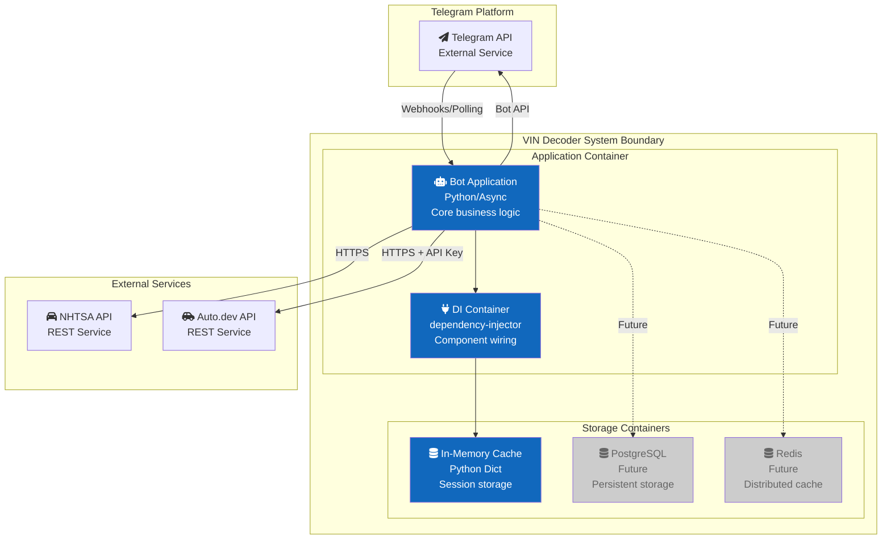

### PlantUML Diagram
```plantuml
@startuml C4_Container
!include https://raw.githubusercontent.com/plantuml-stdlib/C4-PlantUML/master/C4_Container.puml

title Container Diagram - VIN Decoder Bot

Person(user, "Telegram User")

System_Boundary(vinbot, "VIN Decoder System") {
    Container(bot_app, "Bot Application", "Python 3.9+, asyncio", "Handles Telegram interactions and orchestrates VIN decoding")
    Container(di_container, "DI Container", "dependency-injector", "Manages component lifecycle and wiring")
    Container(cache, "In-Memory Cache", "Python collections", "Temporary storage for sessions and responses")
    Container(future_db, "PostgreSQL", "PostgreSQL 14", "Persistent storage (future)")
    Container(future_redis, "Redis Cache", "Redis 6", "Distributed cache (future)")
}

System_Ext(telegram, "Telegram API", "Bot API for messaging")
System_Ext(nhtsa, "NHTSA API", "Free VIN decoder")
System_Ext(autodev, "Auto.dev API", "Premium VIN decoder")

Rel(user, telegram, "Sends messages", "HTTPS")
Rel(telegram, bot_app, "Forwards messages", "Webhook/Polling")
Rel(bot_app, telegram, "Sends responses", "Bot API")
Rel(bot_app, di_container, "Uses", "In-process")
Rel(di_container, cache, "Manages", "In-process")
Rel(bot_app, nhtsa, "Queries", "REST/HTTPS")
Rel(bot_app, autodev, "Queries", "REST/HTTPS")
Rel_D(bot_app, future_db, "Stores", "SQL", $tags="future")
Rel_D(bot_app, future_redis, "Caches", "Redis Protocol", $tags="future")

@enduml
```

### Container Responsibilities

#### Bot Application
- **Technology**: Python 3.9+, python-telegram-bot, asyncio
- **Responsibilities**:
  - Telegram message handling
  - Command processing
  - Business logic orchestration
  - External API integration
  - Response formatting

#### DI Container
- **Technology**: dependency-injector
- **Responsibilities**:
  - Component lifecycle management
  - Dependency injection
  - Configuration management
  - Service registration

#### Cache Layer
- **Current**: In-memory Python dictionaries
- **Future**: Redis for distributed caching
- **Responsibilities**:
  - Session management
  - Response caching
  - Rate limiting data

## Level 3: Component Diagram

### Purpose
Shows the internal structure of the Bot Application container.

### Mermaid Diagram
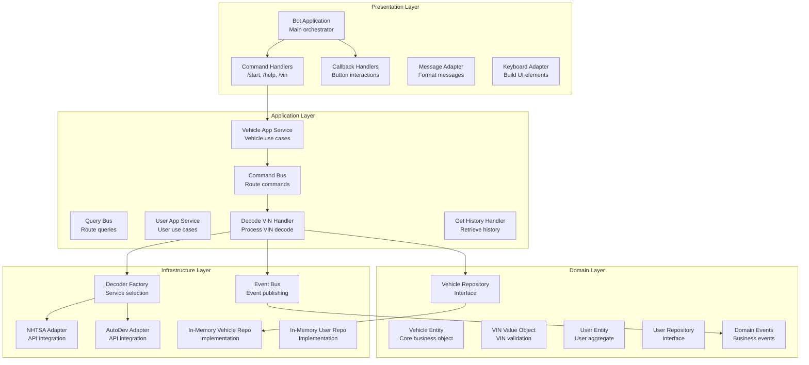

### PlantUML Component Diagram
```plantuml
@startuml C4_Component
!include https://raw.githubusercontent.com/plantuml-stdlib/C4-PlantUML/master/C4_Component.puml

title Component Diagram - Bot Application

Container_Boundary(bot_app, "Bot Application") {
    Component(bot_main, "Bot Application", "Python", "Main entry point and orchestrator")
    Component(cmd_handlers, "Command Handlers", "Python", "Handle /start, /help, /vin commands")
    Component(callback_handlers, "Callback Handlers", "Python", "Handle inline keyboard interactions")
    Component(msg_adapter, "Message Adapter", "Python", "Format and compose messages")
    Component(kb_adapter, "Keyboard Adapter", "Python", "Build inline keyboards")
    
    Component(cmd_bus, "Command Bus", "Python", "Route and execute commands")
    Component(query_bus, "Query Bus", "Python", "Route and execute queries")
    Component(vehicle_service, "Vehicle App Service", "Python", "Orchestrate vehicle use cases")
    Component(user_service, "User App Service", "Python", "Orchestrate user use cases")
    
    Component(decode_handler, "Decode VIN Handler", "Python", "Execute VIN decode command")
    Component(history_handler, "Get History Handler", "Python", "Execute history query")
    
    Component(vehicle_entity, "Vehicle Entity", "Python", "Core vehicle domain model")
    Component(vin_vo, "VIN Value Object", "Python", "VIN validation and parsing")
    Component(user_entity, "User Entity", "Python", "User aggregate root")
    
    Component(decoder_factory, "Decoder Factory", "Python", "Select appropriate decoder service")
    Component(nhtsa_adapter, "NHTSA Adapter", "Python", "NHTSA API integration")
    Component(autodev_adapter, "AutoDev Adapter", "Python", "Auto.dev API integration")
    Component(event_bus, "Event Bus", "Python", "Publish domain events")
}

Rel(bot_main, cmd_handlers, "Delegates", "In-process")
Rel(bot_main, callback_handlers, "Delegates", "In-process")
Rel(cmd_handlers, vehicle_service, "Uses", "In-process")
Rel(vehicle_service, cmd_bus, "Dispatches", "In-process")
Rel(cmd_bus, decode_handler, "Routes", "In-process")
Rel(decode_handler, decoder_factory, "Uses", "In-process")
Rel(decoder_factory, nhtsa_adapter, "Creates", "In-process")
Rel(decoder_factory, autodev_adapter, "Creates", "In-process")
Rel(decode_handler, event_bus, "Publishes", "In-process")

@enduml
```

## Level 4: Code Level (Class Diagrams)

### Domain Model Class Diagram

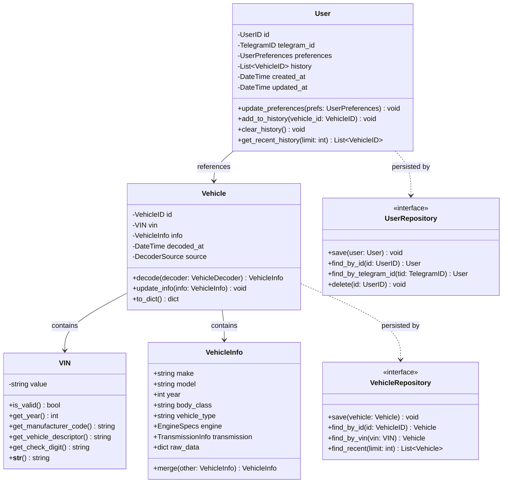

### Application Layer Class Diagram

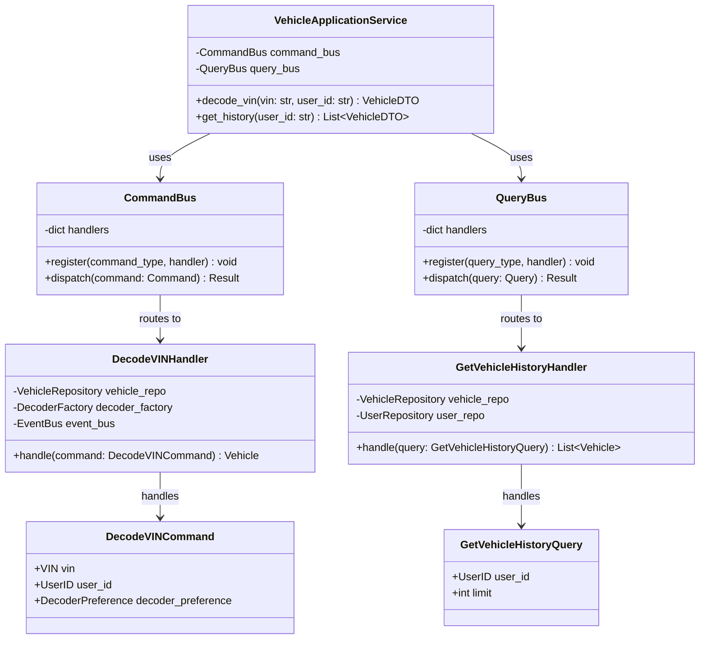

### Infrastructure Layer Class Diagram

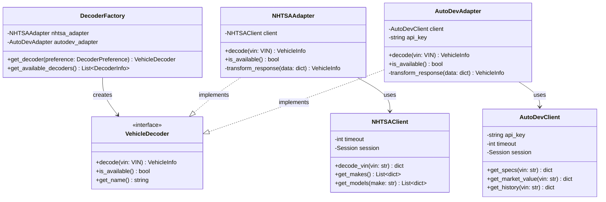

## Sequence Diagrams

### VIN Decode Sequence

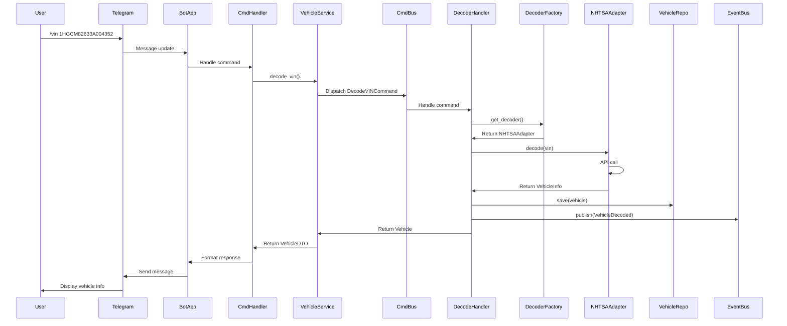

### User Settings Update Sequence

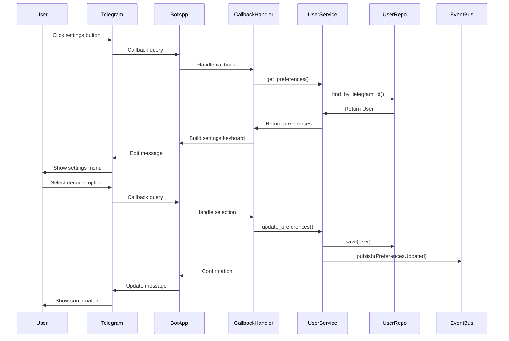

## Deployment Diagram

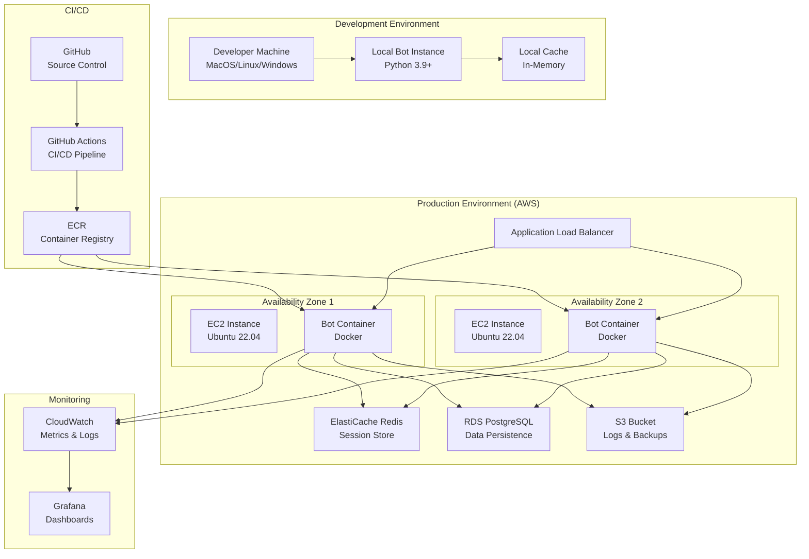

## Technology Stack Details

### Core Technologies
| Layer | Technology | Purpose |
|-------|------------|---------|
| Language | Python 3.9+ | Async support, type hints |
| Framework | python-telegram-bot | Telegram integration |
| DI Container | dependency-injector | IoC and dependency management |
| Validation | pydantic | Data validation and settings |
| Testing | pytest | Unit and integration testing |
| Async | asyncio | Concurrent operations |

### Infrastructure Technologies
| Component | Current | Future |
|-----------|---------|--------|
| Cache | In-memory dict | Redis/ElastiCache |
| Database | None | PostgreSQL/RDS |
| Container | Local Python | Docker |
| Orchestration | Manual | Kubernetes/ECS |
| Monitoring | Console logs | CloudWatch/Datadog |
| CI/CD | Manual | GitHub Actions |

### External Integrations
| Service | Protocol | Authentication |
|---------|----------|----------------|
| Telegram | HTTPS/Webhook | Bot Token |
| NHTSA | REST/HTTPS | None |
| Auto.dev | REST/HTTPS | API Key |

## Architecture Patterns Used

### Domain-Driven Design Patterns
- **Aggregates**: User, Vehicle
- **Value Objects**: VIN, VehicleID, UserID
- **Domain Events**: VehicleDecoded, UserRegistered
- **Repository Pattern**: Abstract persistence
- **Domain Services**: VIN validation logic

### Clean Architecture Patterns
- **Dependency Inversion**: Interfaces in domain
- **Use Cases**: Command and Query handlers
- **Ports and Adapters**: External service adapters
- **DTO Pattern**: Layer data transfer

### Enterprise Patterns
- **CQRS**: Command/Query separation
- **Event Bus**: Domain event publishing
- **Factory Pattern**: Decoder selection
- **Adapter Pattern**: External API integration
- **Strategy Pattern**: Decoder algorithms

## Security Considerations

### API Security
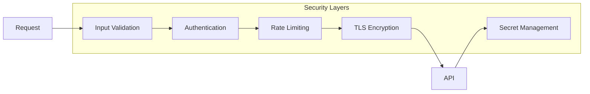

### Data Flow Security
- **Input Validation**: VIN format validation
- **Authentication**: Telegram user verification
- **Rate Limiting**: Per-user request limits
- **Encryption**: TLS for all external calls
- **Secret Management**: Environment variables

## Performance Optimization

### Caching Strategy
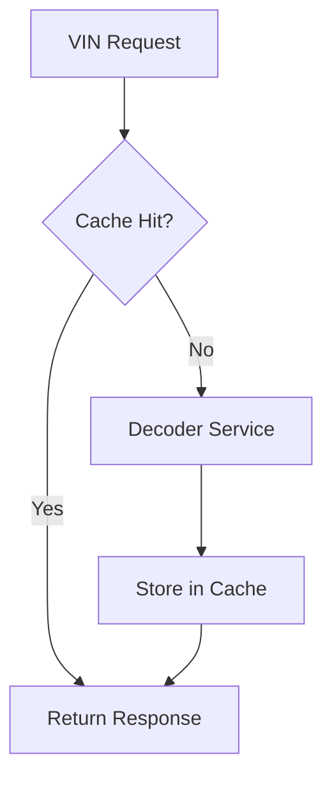

### Optimization Techniques
- **Response Caching**: Cache decoded VINs
- **Connection Pooling**: Reuse HTTP connections
- **Async Operations**: Non-blocking I/O
- **Batch Processing**: Group similar requests
- **Circuit Breaker**: Fail fast on errors

## Monitoring and Observability

### Metrics Collection
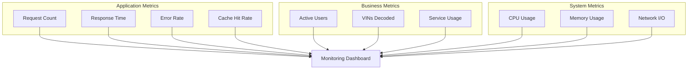

## References

- [C4 Model](https://c4model.com/) - The C4 model for visualizing software architecture
- [Mermaid](https://mermaid-js.github.io/) - Diagram syntax documentation
- [PlantUML](https://plantuml.com/) - UML diagram tool
- [Structurizr](https://structurizr.com/) - Software architecture workspace

---

*Last Updated: January 2025*  
*Version: 1.0.0*