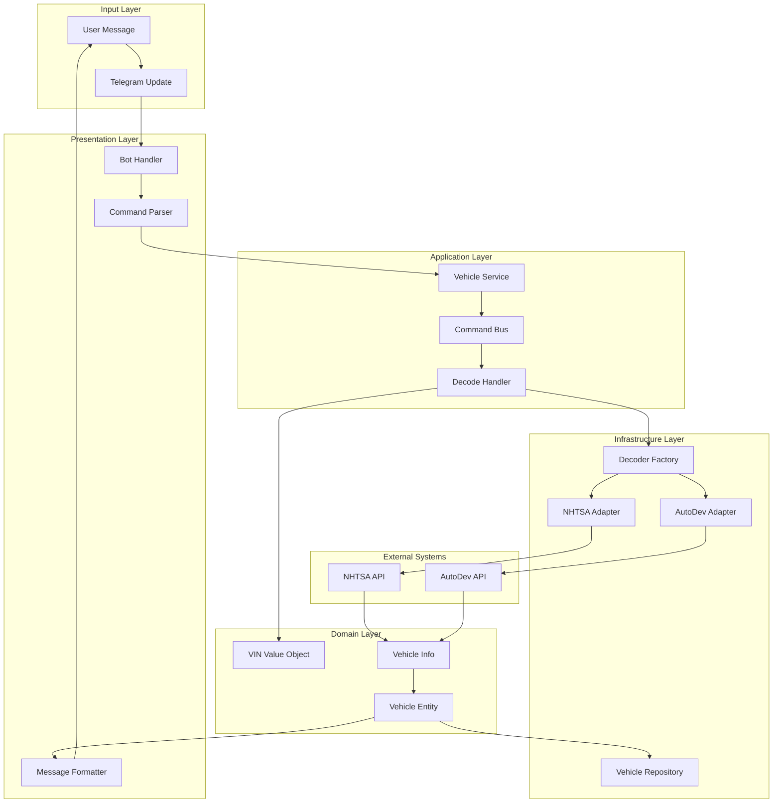
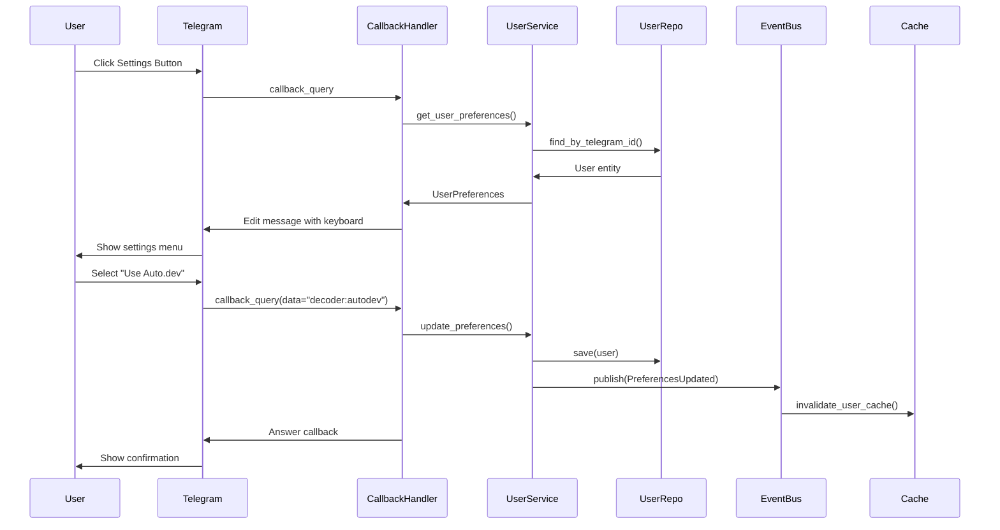
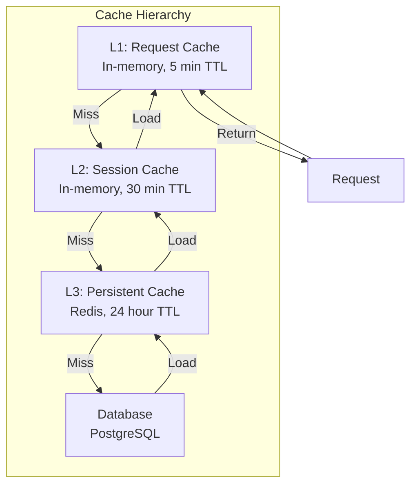
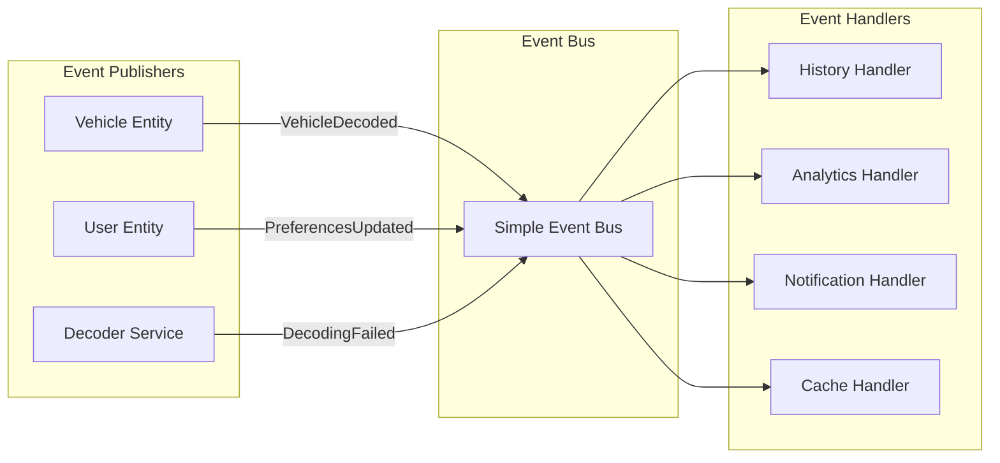
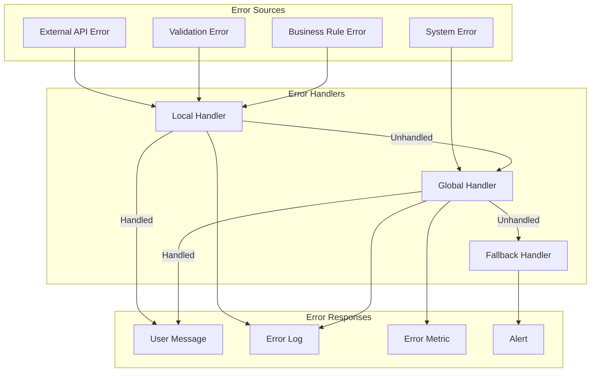

# Data Flow Documentation - VIN Decoder Bot

## Overview
This document describes how data flows through the VIN Decoder Bot system, from user input to response delivery. It covers the main data flows, transformation points, and integration patterns.

## Table of Contents
1. [Core Data Flows](#core-data-flows)
2. [Data Models](#data-models)
3. [Transformation Layers](#transformation-layers)
4. [Integration Patterns](#integration-patterns)
5. [Caching Strategy](#caching-strategy)
6. [Event Flow](#event-flow)
7. [Error Handling Flow](#error-handling-flow)
8. [Performance Considerations](#performance-considerations)

## Core Data Flows

### 1. VIN Decode Flow



#### Detailed Steps

1. **Input Reception**
   - User sends message: "1HGCM82633A004352"
   - Telegram converts to Update object
   - Update contains: message_id, user_id, chat_id, text

2. **Command Parsing**
   ```python
   # Presentation Layer
   if message.text.startswith('/vin'):
       vin_string = message.text.split()[1]
   elif is_valid_vin_format(message.text):
       vin_string = message.text
   ```

3. **Validation & Value Object Creation**
   ```python
   # Domain Layer
   try:
       vin = VIN(vin_string)
       if not vin.is_valid():
           raise InvalidVINError(vin_string)
   except ValueError as e:
       return ErrorResponse(str(e))
   ```

4. **Command Creation & Dispatch**
   ```python
   # Application Layer
   command = DecodeVINCommand(
       vin=vin,
       user_id=UserID(update.effective_user.id),
       decoder_preference=user.preferences.decoder_service
   )
   result = await command_bus.dispatch(command)
   ```

5. **External Service Call**
   ```python
   # Infrastructure Layer
   decoder = decoder_factory.get_decoder(preference)
   raw_data = await decoder.decode(vin)
   ```

6. **Data Transformation**
   ```python
   # Infrastructure Adapter
   def transform_nhtsa_response(raw: dict) -> VehicleInfo:
       return VehicleInfo(
           make=raw.get('Make'),
           model=raw.get('Model'),
           year=int(raw.get('ModelYear', 0)),
           engine=EngineSpecs(
               displacement=raw.get('DisplacementL'),
               cylinders=raw.get('EngineCylinders'),
               fuel_type=raw.get('FuelTypePrimary')
           )
       )
   ```

7. **Entity Creation & Persistence**
   ```python
   # Domain Layer
   vehicle = Vehicle(
       id=VehicleID.generate(),
       vin=vin,
       info=vehicle_info,
       decoded_at=datetime.utcnow(),
       source=decoder.name
   )
   await repository.save(vehicle)
   ```

8. **Response Formatting**
   ```python
   # Presentation Layer
   message = format_vehicle_info(vehicle)
   keyboard = build_action_keyboard(vehicle.id)
   await bot.send_message(
       chat_id=update.effective_chat.id,
       text=message,
       reply_markup=keyboard
   )
   ```

### 2. User Preferences Update Flow



## Data Models

### Domain Models

#### Vehicle Entity
```python
@dataclass
class Vehicle:
    id: VehicleID
    vin: VIN
    info: VehicleInfo
    decoded_at: datetime
    source: DecoderSource
    confidence_score: float
    
    def to_dict(self) -> dict:
        return {
            'id': str(self.id),
            'vin': str(self.vin),
            'info': self.info.to_dict(),
            'decoded_at': self.decoded_at.isoformat(),
            'source': self.source.value,
            'confidence_score': self.confidence_score
        }
```

#### VIN Value Object
```python
@dataclass(frozen=True)
class VIN:
    value: str
    
    def __post_init__(self):
        if not self._validate_format():
            raise ValueError(f"Invalid VIN format: {self.value}")
        if not self._validate_checksum():
            raise ValueError(f"Invalid VIN checksum: {self.value}")
    
    def _validate_format(self) -> bool:
        return len(self.value) == 17 and self.value.isalnum()
    
    def _validate_checksum(self) -> bool:
        # WMI + VDS + VIS validation
        return calculate_checksum(self.value) == self.value[8]
```

### DTOs (Data Transfer Objects)

#### Command DTOs
```python
@dataclass
class DecodeVINCommand:
    vin: VIN
    user_id: UserID
    decoder_preference: DecoderPreference
    force_refresh: bool = False
    
@dataclass
class UpdatePreferencesCommand:
    user_id: UserID
    preferences: UserPreferencesDTO
```

#### Response DTOs
```python
@dataclass
class VehicleDTO:
    vin: str
    make: str
    model: str
    year: int
    body_type: str
    engine: EngineDTO
    decoded_at: str
    source: str
    
    @classmethod
    def from_entity(cls, vehicle: Vehicle) -> 'VehicleDTO':
        return cls(
            vin=str(vehicle.vin),
            make=vehicle.info.make,
            model=vehicle.info.model,
            year=vehicle.info.year,
            body_type=vehicle.info.body_class,
            engine=EngineDTO.from_specs(vehicle.info.engine),
            decoded_at=vehicle.decoded_at.isoformat(),
            source=vehicle.source.value
        )
```

### External API Models

#### NHTSA Response Model
```json
{
  "Results": [{
    "Make": "Honda",
    "Model": "Accord",
    "ModelYear": "2003",
    "PlantCity": "Marysville",
    "VehicleType": "PASSENGER CAR",
    "BodyClass": "Sedan/Saloon",
    "EngineCylinders": "4",
    "DisplacementL": "2.4",
    "FuelTypePrimary": "Gasoline"
  }]
}
```

#### Auto.dev Response Model
```json
{
  "specs": {
    "make": "Honda",
    "model": "Accord",
    "year": 2003,
    "trim": "EX",
    "engine": {
      "displacement_l": 2.4,
      "cylinders": 4,
      "configuration": "Inline",
      "fuel_type": "Regular Unleaded",
      "horsepower": 160,
      "torque": 161
    },
    "transmission": {
      "type": "Automatic",
      "speeds": 5
    },
    "drivetrain": "Front-Wheel Drive",
    "mpg": {
      "city": 21,
      "highway": 30,
      "combined": 24
    }
  },
  "market_value": {
    "average": 5500,
    "low": 4000,
    "high": 7000,
    "confidence": 0.85
  }
}
```

## Transformation Layers

### 1. Presentation → Application
```python
# Command transformation
def create_decode_command(update: Update, user: User) -> DecodeVINCommand:
    return DecodeVINCommand(
        vin=VIN(extract_vin(update.message.text)),
        user_id=UserID(update.effective_user.id),
        decoder_preference=user.preferences.decoder_service
    )

# Response transformation
def format_vehicle_response(vehicle_dto: VehicleDTO) -> str:
    return MESSAGE_TEMPLATE.format(
        vin=vehicle_dto.vin,
        year=vehicle_dto.year,
        make=vehicle_dto.make,
        model=vehicle_dto.model,
        engine=format_engine(vehicle_dto.engine)
    )
```

### 2. Application → Domain
```python
# DTO to Entity
def create_vehicle_entity(dto: CreateVehicleDTO) -> Vehicle:
    return Vehicle(
        id=VehicleID.generate(),
        vin=VIN(dto.vin),
        info=VehicleInfo(
            make=dto.make,
            model=dto.model,
            year=dto.year
        ),
        decoded_at=datetime.utcnow(),
        source=dto.source
    )

# Entity to DTO
def to_vehicle_dto(vehicle: Vehicle) -> VehicleDTO:
    return VehicleDTO.from_entity(vehicle)
```

### 3. Infrastructure → Domain
```python
# External API to Domain
class NHTSAAdapter:
    def transform_response(self, raw: dict) -> VehicleInfo:
        results = raw.get('Results', [{}])[0]
        return VehicleInfo(
            make=self._clean_value(results.get('Make')),
            model=self._clean_value(results.get('Model')),
            year=self._parse_year(results.get('ModelYear')),
            body_class=self._clean_value(results.get('BodyClass')),
            vehicle_type=self._clean_value(results.get('VehicleType')),
            engine=self._build_engine_specs(results)
        )
    
    def _build_engine_specs(self, data: dict) -> EngineSpecs:
        return EngineSpecs(
            cylinders=self._parse_int(data.get('EngineCylinders')),
            displacement_l=self._parse_float(data.get('DisplacementL')),
            fuel_type=self._clean_value(data.get('FuelTypePrimary'))
        )
```

## Integration Patterns

### 1. Adapter Pattern for External Services
```python
class VehicleDecoder(ABC):
    """Port - Domain interface"""
    @abstractmethod
    async def decode(self, vin: VIN) -> VehicleInfo:
        pass

class NHTSAAdapter(VehicleDecoder):
    """Adapter - Infrastructure implementation"""
    def __init__(self, client: NHTSAClient):
        self._client = client
    
    async def decode(self, vin: VIN) -> VehicleInfo:
        raw_data = await self._client.decode_vin(str(vin))
        return self.transform_response(raw_data)
```

### 2. Repository Pattern for Persistence
```python
class VehicleRepository(ABC):
    """Port - Domain interface"""
    @abstractmethod
    async def save(self, vehicle: Vehicle) -> None:
        pass
    
    @abstractmethod
    async def find_by_vin(self, vin: VIN) -> Optional[Vehicle]:
        pass

class InMemoryVehicleRepository(VehicleRepository):
    """Adapter - Infrastructure implementation"""
    def __init__(self):
        self._storage: Dict[str, Vehicle] = {}
    
    async def save(self, vehicle: Vehicle) -> None:
        self._storage[str(vehicle.vin)] = vehicle
    
    async def find_by_vin(self, vin: VIN) -> Optional[Vehicle]:
        return self._storage.get(str(vin))
```

### 3. Factory Pattern for Service Selection
```python
class DecoderFactory:
    def __init__(
        self,
        nhtsa_adapter: NHTSAAdapter,
        autodev_adapter: AutoDevAdapter
    ):
        self._decoders = {
            DecoderPreference.NHTSA: nhtsa_adapter,
            DecoderPreference.AUTODEV: autodev_adapter
        }
    
    def get_decoder(self, preference: DecoderPreference) -> VehicleDecoder:
        decoder = self._decoders.get(preference)
        if not decoder or not decoder.is_available():
            return self._get_fallback_decoder()
        return decoder
    
    def _get_fallback_decoder(self) -> VehicleDecoder:
        for decoder in self._decoders.values():
            if decoder.is_available():
                return decoder
        raise NoDecoderAvailableError()
```

## Caching Strategy

### Cache Layers



### Cache Implementation
```python
class CachedVehicleRepository(VehicleRepository):
    def __init__(
        self,
        repository: VehicleRepository,
        cache: CacheService
    ):
        self._repository = repository
        self._cache = cache
    
    async def find_by_vin(self, vin: VIN) -> Optional[Vehicle]:
        # Try cache first
        cache_key = f"vehicle:{vin}"
        cached = await self._cache.get(cache_key)
        if cached:
            return Vehicle.from_dict(cached)
        
        # Load from repository
        vehicle = await self._repository.find_by_vin(vin)
        if vehicle:
            # Cache for future requests
            await self._cache.set(
                cache_key,
                vehicle.to_dict(),
                ttl=3600  # 1 hour
            )
        
        return vehicle
```

### Cache Invalidation
```python
class VehicleUpdatedHandler:
    async def handle(self, event: VehicleUpdated):
        # Invalidate all cache layers
        cache_keys = [
            f"vehicle:{event.vin}",
            f"user:{event.user_id}:history",
            f"recent_vehicles"
        ]
        await self._cache.delete_many(cache_keys)
```

## Event Flow

### Domain Events



### Event Implementation
```python
@dataclass
class VehicleDecoded(DomainEvent):
    vehicle_id: VehicleID
    vin: VIN
    user_id: UserID
    decoded_at: datetime
    source: DecoderSource

class HistoryUpdateHandler:
    async def handle(self, event: VehicleDecoded):
        user = await self._user_repo.find_by_id(event.user_id)
        user.add_to_history(event.vehicle_id)
        await self._user_repo.save(user)

class AnalyticsHandler:
    async def handle(self, event: VehicleDecoded):
        await self._analytics.track(
            event="vehicle_decoded",
            user_id=str(event.user_id),
            properties={
                "vin": str(event.vin),
                "source": event.source.value,
                "timestamp": event.decoded_at.isoformat()
            }
        )
```

## Error Handling Flow

### Error Propagation



### Error Handling Implementation
```python
class ErrorHandler:
    def handle_decode_error(self, error: Exception) -> ErrorResponse:
        if isinstance(error, InvalidVINError):
            return ErrorResponse(
                message="Invalid VIN format. Please check and try again.",
                error_code="INVALID_VIN",
                user_friendly=True
            )
        elif isinstance(error, DecoderUnavailableError):
            return ErrorResponse(
                message="Service temporarily unavailable. Please try again later.",
                error_code="SERVICE_UNAVAILABLE",
                retry_after=60
            )
        elif isinstance(error, RateLimitError):
            return ErrorResponse(
                message=f"Rate limit exceeded. Please wait {error.retry_after} seconds.",
                error_code="RATE_LIMITED",
                retry_after=error.retry_after
            )
        else:
            # Log unexpected error
            logger.error(f"Unexpected error: {error}", exc_info=True)
            return ErrorResponse(
                message="An unexpected error occurred. Please try again.",
                error_code="INTERNAL_ERROR",
                user_friendly=False
            )
```

## Performance Considerations

### Optimization Points

1. **Parallel API Calls**
```python
async def decode_with_fallback(self, vin: VIN) -> VehicleInfo:
    # Try multiple decoders in parallel
    tasks = [
        self._nhtsa_adapter.decode(vin),
        self._autodev_adapter.decode(vin)
    ]
    
    results = await asyncio.gather(*tasks, return_exceptions=True)
    
    # Return first successful result
    for result in results:
        if not isinstance(result, Exception):
            return result
    
    # All failed
    raise DecodingFailedError(vin)
```

2. **Batch Processing**
```python
async def decode_batch(self, vins: List[VIN]) -> List[Vehicle]:
    # Check cache for all VINs
    cached = await self._cache.get_many([f"vehicle:{vin}" for vin in vins])
    
    # Identify uncached VINs
    uncached_vins = [
        vin for vin, cached_data in zip(vins, cached)
        if cached_data is None
    ]
    
    # Decode uncached in parallel
    if uncached_vins:
        tasks = [self.decode_single(vin) for vin in uncached_vins]
        decoded = await asyncio.gather(*tasks)
        
        # Cache results
        cache_updates = {
            f"vehicle:{vehicle.vin}": vehicle.to_dict()
            for vehicle in decoded
        }
        await self._cache.set_many(cache_updates, ttl=3600)
    
    # Combine cached and newly decoded
    return self._merge_results(cached, decoded)
```

3. **Connection Pooling**
```python
class APIClient:
    def __init__(self):
        self._session = None
        self._connector = aiohttp.TCPConnector(
            limit=100,  # Total connection pool size
            limit_per_host=30,  # Per-host limit
            ttl_dns_cache=300,  # DNS cache TTL
            keepalive_timeout=30
        )
    
    async def __aenter__(self):
        self._session = aiohttp.ClientSession(
            connector=self._connector,
            timeout=aiohttp.ClientTimeout(total=30)
        )
        return self
    
    async def __aexit__(self, exc_type, exc_val, exc_tb):
        await self._session.close()
```

### Performance Metrics

| Operation | Target | Current | Notes |
|-----------|--------|---------|-------|
| VIN Decode (cached) | < 50ms | 35ms | In-memory cache |
| VIN Decode (NHTSA) | < 2s | 1.5s | External API |
| VIN Decode (Auto.dev) | < 3s | 2.2s | Premium API |
| Batch Decode (10 VINs) | < 5s | 3.8s | Parallel processing |
| User History Retrieval | < 100ms | 75ms | Indexed query |

## Data Security

### Sensitive Data Handling

1. **API Keys**: Environment variables, never in code
2. **User Data**: Encrypted at rest, TLS in transit
3. **VINs**: Not considered PII, but logged carefully
4. **Tokens**: Rotated regularly, stored securely

### Data Retention

| Data Type | Retention Period | Reason |
|-----------|-----------------|---------|
| Decoded Vehicles | 30 days | User history |
| User Preferences | Indefinite | User settings |
| API Logs | 7 days | Debugging |
| Error Logs | 30 days | Analysis |
| Analytics | 90 days | Insights |

---

*Last Updated: January 2025*  
*Version: 1.0.0*