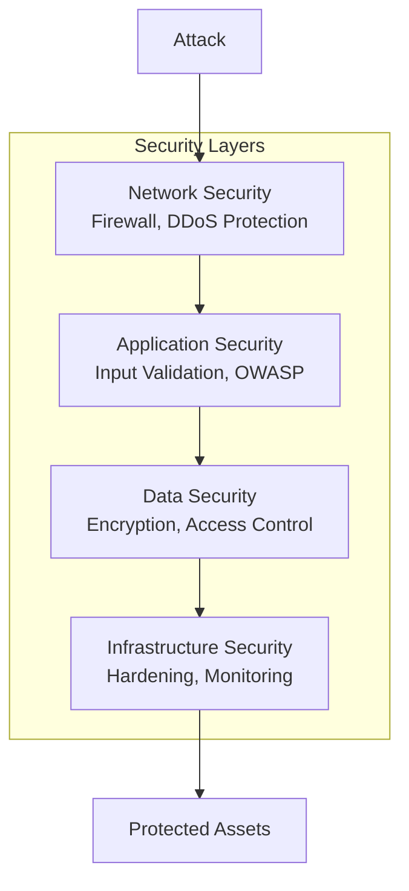
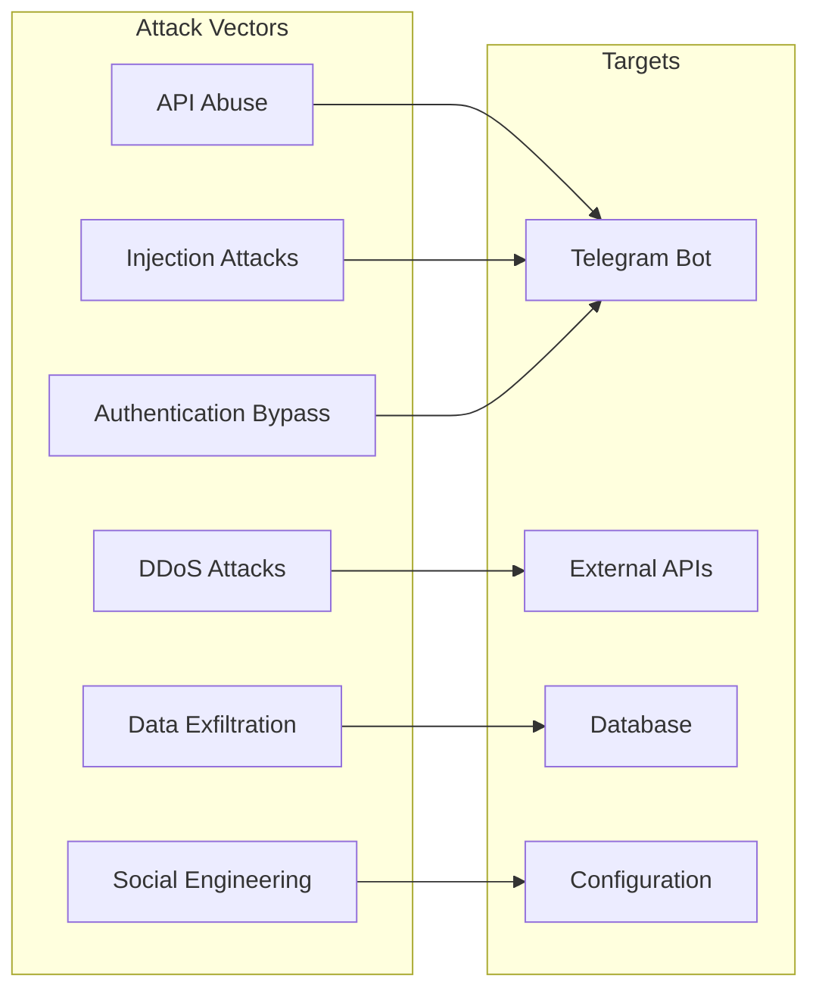
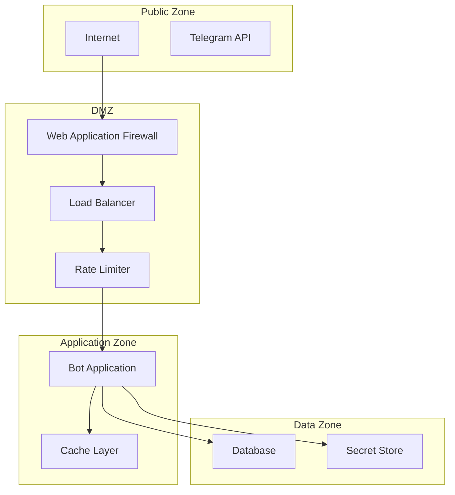

# Security Architecture - VIN Decoder Bot

## Overview
This document outlines the security architecture, threat model, and security controls implemented in the VIN Decoder Bot system.

## Table of Contents
1. [Security Principles](#security-principles)
2. [Threat Model](#threat-model)
3. [Security Architecture](#security-architecture)
4. [Authentication & Authorization](#authentication--authorization)
5. [Data Protection](#data-protection)
6. [API Security](#api-security)
7. [Infrastructure Security](#infrastructure-security)
8. [Security Controls](#security-controls)
9. [Compliance & Privacy](#compliance--privacy)
10. [Incident Response](#incident-response)
11. [Security Checklist](#security-checklist)

## Security Principles

### Defense in Depth
Multiple layers of security controls to protect against various attack vectors.



### Zero Trust Architecture
- Never trust, always verify
- Least privilege access
- Assume breach mentality
- Continuous verification

### Security by Design
- Security considered at every stage
- Secure defaults
- Fail securely
- Minimize attack surface

## Threat Model

### Assets
1. **User Data**: Telegram IDs, preferences, history
2. **API Keys**: Telegram bot token, Auto.dev API key
3. **VIN Data**: Decoded vehicle information
4. **System**: Bot application and infrastructure

### Threat Actors
1. **External Attackers**: Hackers, script kiddies
2. **Malicious Users**: Abusive bot users
3. **Insider Threats**: Compromised accounts
4. **Automated Threats**: Bots, scrapers

### Attack Vectors



### STRIDE Analysis

| Threat | Description | Mitigation |
|--------|-------------|------------|
| **Spoofing** | Fake Telegram users | User ID verification |
| **Tampering** | Modified messages | Message integrity checks |
| **Repudiation** | Deny actions | Audit logging |
| **Information Disclosure** | Data leaks | Encryption, access control |
| **Denial of Service** | Service disruption | Rate limiting, scaling |
| **Elevation of Privilege** | Unauthorized access | RBAC, least privilege |

## Security Architecture

### Security Zones



### Security Components

#### Input Validation Layer
```python
class InputValidator:
    @staticmethod
    def validate_vin(vin: str) -> bool:
        """Validate VIN format and checksum."""
        # Length check
        if len(vin) != 17:
            return False
        
        # Character whitelist
        if not re.match(r'^[A-HJ-NPR-Z0-9]{17}$', vin):
            return False
        
        # Checksum validation
        if not VINValidator.verify_checksum(vin):
            return False
        
        return True
    
    @staticmethod
    def sanitize_user_input(text: str) -> str:
        """Sanitize user input to prevent injection."""
        # Remove control characters
        text = ''.join(char for char in text if ord(char) >= 32)
        
        # Escape special characters
        text = html.escape(text)
        
        # Limit length
        return text[:1000]
```

#### Authentication Middleware
```python
class TelegramAuthMiddleware:
    async def authenticate(self, update: Update) -> Optional[User]:
        """Verify Telegram user identity."""
        if not update.effective_user:
            raise AuthenticationError("No user in update")
        
        # Verify update is from Telegram
        if not self.verify_telegram_signature(update):
            raise AuthenticationError("Invalid signature")
        
        # Get or create user
        user = await self.user_service.get_or_create(
            telegram_id=update.effective_user.id,
            username=update.effective_user.username
        )
        
        # Check if user is banned
        if user.is_banned:
            raise AuthorizationError("User is banned")
        
        return user
```

## Authentication & Authorization

### Telegram Authentication

#### Bot Token Security
```python
class BotTokenManager:
    def __init__(self):
        # Load from environment
        self._token = os.environ.get("TELEGRAM_BOT_TOKEN")
        if not self._token:
            raise ConfigurationError("Bot token not configured")
        
        # Validate token format
        if not self._validate_token_format(self._token):
            raise ConfigurationError("Invalid bot token format")
    
    def _validate_token_format(self, token: str) -> bool:
        """Validate Telegram bot token format."""
        pattern = r'^\d{8,10}:[a-zA-Z0-9_-]{35}$'
        return bool(re.match(pattern, token))
    
    def get_token(self) -> str:
        """Get bot token for use."""
        return self._token
    
    def rotate_token(self, new_token: str) -> None:
        """Rotate bot token (requires bot restart)."""
        if self._validate_token_format(new_token):
            self._token = new_token
            # Trigger application restart
            self._restart_application()
```

#### User Verification
```python
class UserVerification:
    async def verify_user(self, telegram_id: int) -> bool:
        """Verify user is legitimate."""
        # Check against known bot list
        if telegram_id in KNOWN_BOT_IDS:
            return False
        
        # Check account age (if available)
        user_info = await self.get_user_info(telegram_id)
        if user_info.created_at > datetime.now() - timedelta(days=7):
            # New account, additional checks
            return await self.additional_verification(user_info)
        
        return True
```

### Authorization Model

#### Role-Based Access Control (RBAC)
```python
class Role(Enum):
    USER = "user"
    PREMIUM = "premium"
    ADMIN = "admin"

class Permission(Enum):
    DECODE_VIN = "decode_vin"
    VIEW_HISTORY = "view_history"
    USE_PREMIUM_API = "use_premium_api"
    ADMIN_COMMANDS = "admin_commands"

ROLE_PERMISSIONS = {
    Role.USER: [Permission.DECODE_VIN, Permission.VIEW_HISTORY],
    Role.PREMIUM: [
        Permission.DECODE_VIN,
        Permission.VIEW_HISTORY,
        Permission.USE_PREMIUM_API
    ],
    Role.ADMIN: [
        Permission.DECODE_VIN,
        Permission.VIEW_HISTORY,
        Permission.USE_PREMIUM_API,
        Permission.ADMIN_COMMANDS
    ]
}

class AuthorizationService:
    def has_permission(
        self,
        user: User,
        permission: Permission
    ) -> bool:
        """Check if user has specific permission."""
        user_permissions = ROLE_PERMISSIONS.get(user.role, [])
        return permission in user_permissions
```

## Data Protection

### Encryption

#### Data at Rest
```python
class EncryptionService:
    def __init__(self):
        # Load encryption key from secure storage
        self._key = self._load_key()
        self._cipher = Fernet(self._key)
    
    def encrypt_sensitive_data(self, data: str) -> str:
        """Encrypt sensitive data before storage."""
        return self._cipher.encrypt(data.encode()).decode()
    
    def decrypt_sensitive_data(self, encrypted: str) -> str:
        """Decrypt sensitive data after retrieval."""
        return self._cipher.decrypt(encrypted.encode()).decode()
    
    def _load_key(self) -> bytes:
        """Load encryption key from secure storage."""
        key = os.environ.get("ENCRYPTION_KEY")
        if not key:
            raise SecurityError("Encryption key not configured")
        return key.encode()
```

#### Data in Transit
- All external communications use HTTPS/TLS 1.3
- Certificate pinning for critical APIs
- Perfect Forward Secrecy (PFS) enabled

### Personal Data Handling

#### Data Minimization
```python
class DataMinimization:
    @staticmethod
    def minimize_user_data(user: User) -> dict:
        """Return minimal user data necessary."""
        return {
            "id": user.id,
            "preferences": user.preferences,
            # Exclude: telegram_id, username, created_at
        }
    
    @staticmethod
    def anonymize_vin(vin: str) -> str:
        """Partially anonymize VIN for logs."""
        if len(vin) != 17:
            return "INVALID"
        # Keep manufacturer and check digit, mask serial
        return f"{vin[:8]}*****{vin[-4:]}"
```

#### Data Retention
```python
class DataRetentionPolicy:
    RETENTION_PERIODS = {
        "user_data": timedelta(days=365),
        "vin_history": timedelta(days=90),
        "api_logs": timedelta(days=7),
        "error_logs": timedelta(days=30),
        "audit_logs": timedelta(days=365)
    }
    
    async def cleanup_expired_data(self):
        """Remove data past retention period."""
        for data_type, retention in self.RETENTION_PERIODS.items():
            cutoff = datetime.utcnow() - retention
            await self.delete_before(data_type, cutoff)
```

## API Security

### Rate Limiting

```python
class RateLimiter:
    def __init__(self):
        self.limits = {
            "global": {"requests": 1000, "window": 60},
            "per_user": {"requests": 30, "window": 60},
            "per_ip": {"requests": 100, "window": 60}
        }
    
    async def check_rate_limit(
        self,
        identifier: str,
        limit_type: str
    ) -> bool:
        """Check if request is within rate limits."""
        key = f"rate_limit:{limit_type}:{identifier}"
        
        # Increment counter
        count = await self.cache.incr(key)
        
        if count == 1:
            # First request, set expiry
            await self.cache.expire(
                key,
                self.limits[limit_type]["window"]
            )
        
        # Check limit
        if count > self.limits[limit_type]["requests"]:
            raise RateLimitExceeded(
                f"Rate limit exceeded for {limit_type}"
            )
        
        return True
```

### API Key Management

```python
class APIKeyManager:
    def __init__(self):
        self._keys = {}
        self._load_keys()
    
    def _load_keys(self):
        """Load API keys from secure storage."""
        # Load from environment variables
        self._keys["autodev"] = self._load_secure_key("AUTODEV_API_KEY")
        
        # Validate keys
        for service, key in self._keys.items():
            if not self._validate_key(service, key):
                logger.warning(f"Invalid API key for {service}")
    
    def _load_secure_key(self, env_var: str) -> Optional[str]:
        """Load key from environment with validation."""
        key = os.environ.get(env_var)
        if key and key.startswith("sk_"):  # Example validation
            return key
        return None
    
    def get_key(self, service: str) -> Optional[str]:
        """Get API key for service."""
        return self._keys.get(service)
    
    async def rotate_key(self, service: str, new_key: str):
        """Rotate API key for service."""
        # Validate new key
        if not self._validate_key(service, new_key):
            raise ValueError("Invalid API key")
        
        # Update in memory
        old_key = self._keys.get(service)
        self._keys[service] = new_key
        
        # Test new key
        if not await self._test_key(service, new_key):
            # Rollback
            self._keys[service] = old_key
            raise ValueError("New key validation failed")
        
        # Update persistent storage
        await self._update_secure_storage(service, new_key)
```

### Request Signing

```python
class RequestSigner:
    def sign_request(
        self,
        method: str,
        url: str,
        body: Optional[str] = None
    ) -> dict:
        """Sign API request for integrity."""
        timestamp = str(int(time.time()))
        nonce = secrets.token_hex(16)
        
        # Create signature base
        signature_base = f"{method}\n{url}\n{timestamp}\n{nonce}"
        if body:
            body_hash = hashlib.sha256(body.encode()).hexdigest()
            signature_base += f"\n{body_hash}"
        
        # Sign with HMAC
        signature = hmac.new(
            self.secret_key.encode(),
            signature_base.encode(),
            hashlib.sha256
        ).hexdigest()
        
        return {
            "X-Timestamp": timestamp,
            "X-Nonce": nonce,
            "X-Signature": signature
        }
```

## Infrastructure Security

### Container Security

```dockerfile
# Dockerfile security best practices
FROM python:3.9-slim-bullseye

# Run as non-root user
RUN groupadd -r appuser && useradd -r -g appuser appuser

# Set security labels
LABEL security.scan="enabled" \
      security.updates="auto"

# Install security updates
RUN apt-get update && \
    apt-get upgrade -y && \
    apt-get install -y --no-install-recommends \
        ca-certificates && \
    rm -rf /var/lib/apt/lists/*

# Copy requirements first for layer caching
COPY requirements.txt .
RUN pip install --no-cache-dir -r requirements.txt

# Copy application code
COPY --chown=appuser:appuser . /app
WORKDIR /app

# Switch to non-root user
USER appuser

# Health check
HEALTHCHECK --interval=30s --timeout=3s --start-period=5s --retries=3 \
  CMD python -c "import requests; requests.get('http://localhost:8080/health')"

# Run application
CMD ["python", "-m", "src.main"]
```

### Network Security

```yaml
# Kubernetes NetworkPolicy
apiVersion: networking.k8s.io/v1
kind: NetworkPolicy
metadata:
  name: vindecoder-network-policy
spec:
  podSelector:
    matchLabels:
      app: vindecoder
  policyTypes:
  - Ingress
  - Egress
  ingress:
  - from:
    - podSelector:
        matchLabels:
          app: nginx-ingress
    ports:
    - protocol: TCP
      port: 8080
  egress:
  - to:
    - podSelector:
        matchLabels:
          app: redis
    ports:
    - protocol: TCP
      port: 6379
  - to:
    - podSelector:
        matchLabels:
          app: postgres
    ports:
    - protocol: TCP
      port: 5432
  # Allow external APIs
  - to:
    - namespaceSelector: {}
    ports:
    - protocol: TCP
      port: 443
```

### Secrets Management

```python
class SecretManager:
    def __init__(self):
        self.provider = self._init_provider()
    
    def _init_provider(self):
        """Initialize secret provider (AWS Secrets Manager, Vault, etc.)."""
        if os.environ.get("AWS_REGION"):
            return AWSSecretsManager()
        elif os.environ.get("VAULT_ADDR"):
            return HashiCorpVault()
        else:
            # Fallback to environment variables
            return EnvironmentSecrets()
    
    async def get_secret(self, key: str) -> str:
        """Retrieve secret from secure storage."""
        try:
            secret = await self.provider.get_secret(key)
            
            # Audit secret access
            await self.audit_log.record(
                action="secret_accessed",
                secret_key=key,
                timestamp=datetime.utcnow()
            )
            
            return secret
        except Exception as e:
            logger.error(f"Failed to retrieve secret {key}: {e}")
            raise SecretRetrievalError(f"Cannot access secret: {key}")
    
    async def rotate_secret(self, key: str, new_value: str):
        """Rotate a secret value."""
        # Store new version
        await self.provider.create_secret_version(key, new_value)
        
        # Mark old version for deletion
        await self.provider.schedule_deletion(key, days=7)
        
        # Audit rotation
        await self.audit_log.record(
            action="secret_rotated",
            secret_key=key,
            timestamp=datetime.utcnow()
        )
```

## Security Controls

### Input Validation

```python
class SecurityValidator:
    @staticmethod
    def validate_telegram_command(text: str) -> bool:
        """Validate Telegram command format."""
        # Max length
        if len(text) > 4096:
            return False
        
        # Command injection prevention
        dangerous_patterns = [
            r'\$\(',  # Command substitution
            r'`',     # Backticks
            r'&&',    # Command chaining
            r'\|\|',  # Command chaining
            r';',     # Command separator
            r'>',     # Redirection
            r'<',     # Redirection
        ]
        
        for pattern in dangerous_patterns:
            if re.search(pattern, text):
                return False
        
        return True
    
    @staticmethod
    def validate_api_response(response: dict) -> bool:
        """Validate external API response."""
        # Check for expected structure
        required_fields = ["success", "data"]
        if not all(field in response for field in required_fields):
            return False
        
        # Validate data types
        if not isinstance(response["success"], bool):
            return False
        
        # Check for injection attempts in data
        if SecurityValidator.contains_injection(str(response)):
            return False
        
        return True
```

### Output Encoding

```python
class OutputEncoder:
    @staticmethod
    def encode_for_telegram(text: str) -> str:
        """Encode text for safe Telegram display."""
        # Escape Telegram markdown special characters
        special_chars = ['_', '*', '[', ']', '(', ')', '~', '`', '>', '#', '+', '-', '=', '|', '{', '}', '.', '!']
        for char in special_chars:
            text = text.replace(char, f'\\{char}')
        
        return text
    
    @staticmethod
    def encode_for_log(text: str) -> str:
        """Encode text for safe logging."""
        # Remove control characters
        text = ''.join(char for char in text if ord(char) >= 32 or char == '\n')
        
        # Truncate if too long
        if len(text) > 1000:
            text = text[:997] + "..."
        
        return text
```

### Security Headers

```python
class SecurityHeaders:
    DEFAULT_HEADERS = {
        "X-Content-Type-Options": "nosniff",
        "X-Frame-Options": "DENY",
        "X-XSS-Protection": "1; mode=block",
        "Strict-Transport-Security": "max-age=31536000; includeSubDomains",
        "Content-Security-Policy": "default-src 'self'",
        "Referrer-Policy": "strict-origin-when-cross-origin"
    }
    
    @staticmethod
    def apply_headers(response: Response) -> Response:
        """Apply security headers to response."""
        for header, value in SecurityHeaders.DEFAULT_HEADERS.items():
            response.headers[header] = value
        
        return response
```

## Compliance & Privacy

### GDPR Compliance

```python
class GDPRCompliance:
    async def handle_data_request(
        self,
        user_id: str,
        request_type: str
    ) -> dict:
        """Handle GDPR data requests."""
        if request_type == "access":
            # Right to access
            return await self.export_user_data(user_id)
        
        elif request_type == "portability":
            # Right to data portability
            data = await self.export_user_data(user_id)
            return self.format_for_portability(data)
        
        elif request_type == "erasure":
            # Right to be forgotten
            await self.delete_user_data(user_id)
            return {"status": "deleted"}
        
        elif request_type == "rectification":
            # Right to rectification
            return {"status": "update_required"}
    
    async def export_user_data(self, user_id: str) -> dict:
        """Export all user data."""
        user = await self.user_repo.find_by_id(user_id)
        history = await self.vehicle_repo.find_by_user(user_id)
        
        return {
            "user": user.to_dict(),
            "history": [v.to_dict() for v in history],
            "exported_at": datetime.utcnow().isoformat()
        }
    
    async def delete_user_data(self, user_id: str):
        """Delete all user data."""
        # Delete from all repositories
        await self.user_repo.delete(user_id)
        await self.vehicle_repo.delete_by_user(user_id)
        
        # Clear cache
        await self.cache.delete_pattern(f"user:{user_id}:*")
        
        # Audit deletion
        await self.audit_log.record(
            action="user_data_deleted",
            user_id=user_id,
            timestamp=datetime.utcnow()
        )
```

### Privacy Policy Implementation

```python
class PrivacyPolicy:
    @staticmethod
    def get_data_collection_notice() -> str:
        """Get data collection notice for users."""
        return """
        📋 Privacy Notice
        
        We collect and process:
        • Your Telegram ID for authentication
        • VINs you decode for history feature
        • Usage preferences you set
        
        We do NOT collect:
        • Personal information beyond Telegram ID
        • Location data
        • Message content beyond VINs
        
        Your data is:
        • Encrypted in storage
        • Deleted after 90 days of inactivity
        • Never shared with third parties
        • Available for export on request
        
        Use /privacy for full policy
        Use /delete to remove all your data
        """
```

## Incident Response

### Incident Response Plan

```python
class IncidentResponse:
    SEVERITY_LEVELS = {
        "CRITICAL": 1,  # Data breach, system compromise
        "HIGH": 2,      # Service disruption, authentication bypass
        "MEDIUM": 3,    # Performance degradation, minor vulnerability
        "LOW": 4        # Non-critical bugs, false positives
    }
    
    async def handle_incident(
        self,
        incident_type: str,
        severity: int,
        details: dict
    ):
        """Handle security incident."""
        incident_id = str(uuid4())
        
        # Log incident
        await self.log_incident(incident_id, incident_type, severity, details)
        
        # Immediate response based on severity
        if severity <= 2:  # Critical or High
            await self.emergency_response(incident_id)
        
        # Notify relevant parties
        await self.notify_stakeholders(incident_id, severity)
        
        # Start investigation
        await self.start_investigation(incident_id)
        
        return incident_id
    
    async def emergency_response(self, incident_id: str):
        """Emergency response for critical incidents."""
        # Isolate affected systems
        await self.isolate_systems()
        
        # Revoke potentially compromised credentials
        await self.revoke_credentials()
        
        # Enable enhanced monitoring
        await self.enable_enhanced_monitoring()
        
        # Create incident snapshot
        await self.create_forensic_snapshot(incident_id)
```

### Security Monitoring

```python
class SecurityMonitor:
    def __init__(self):
        self.alerts = []
        self.thresholds = {
            "failed_auth_attempts": 5,
            "rate_limit_violations": 10,
            "invalid_vin_attempts": 20,
            "api_errors": 50
        }
    
    async def monitor(self):
        """Continuous security monitoring."""
        while True:
            # Check authentication failures
            auth_failures = await self.check_auth_failures()
            if auth_failures > self.thresholds["failed_auth_attempts"]:
                await self.raise_alert("Possible brute force attack")
            
            # Check rate limit violations
            rate_violations = await self.check_rate_violations()
            if rate_violations > self.thresholds["rate_limit_violations"]:
                await self.raise_alert("Rate limit abuse detected")
            
            # Check for patterns
            await self.check_attack_patterns()
            
            # Sleep before next check
            await asyncio.sleep(60)
    
    async def check_attack_patterns(self):
        """Check for known attack patterns."""
        patterns = [
            self.check_sql_injection_attempts,
            self.check_xss_attempts,
            self.check_path_traversal,
            self.check_command_injection
        ]
        
        for pattern_check in patterns:
            if await pattern_check():
                await self.raise_alert(f"Attack pattern detected: {pattern_check.__name__}")
```

## Security Checklist

### Development Security Checklist

- [ ] All user input is validated and sanitized
- [ ] SQL queries use parameterized statements
- [ ] Sensitive data is encrypted at rest
- [ ] All external communications use HTTPS/TLS
- [ ] API keys are stored securely (not in code)
- [ ] Dependencies are up to date
- [ ] Security headers are configured
- [ ] Error messages don't reveal sensitive info
- [ ] Logging doesn't include sensitive data
- [ ] Rate limiting is implemented

### Deployment Security Checklist

- [ ] Production uses different credentials than development
- [ ] Secrets are managed through secure service
- [ ] Network segmentation is configured
- [ ] Firewall rules are restrictive
- [ ] Container images are scanned for vulnerabilities
- [ ] Resource limits are set (CPU, memory)
- [ ] Health checks are configured
- [ ] Backup and recovery tested
- [ ] Incident response plan documented
- [ ] Security monitoring is active

### Operational Security Checklist

- [ ] Regular security updates applied
- [ ] API keys rotated periodically
- [ ] Access logs reviewed regularly
- [ ] Anomaly detection configured
- [ ] Penetration testing performed
- [ ] Security training completed
- [ ] Compliance audits passed
- [ ] Data retention policies enforced
- [ ] User data requests handled properly
- [ ] Security metrics tracked

## Security Testing

### Security Test Suite

```python
import pytest
from security_tests import SecurityTester

class TestSecurity:
    @pytest.mark.security
    async def test_sql_injection(self):
        """Test SQL injection prevention."""
        payloads = [
            "'; DROP TABLE users; --",
            "1' OR '1'='1",
            "admin'--",
            "' UNION SELECT * FROM users--"
        ]
        
        for payload in payloads:
            response = await self.client.decode_vin(payload)
            assert response.status_code == 400
            assert "Invalid VIN" in response.text
    
    @pytest.mark.security
    async def test_xss_prevention(self):
        """Test XSS prevention."""
        payloads = [
            "<script>alert('XSS')</script>",
            "",
            "javascript:alert('XSS')"
        ]
        
        for payload in payloads:
            response = await self.client.send_message(payload)
            # Check response is escaped
            assert "<script>" not in response.text
            assert "javascript:" not in response.text
    
    @pytest.mark.security
    async def test_rate_limiting(self):
        """Test rate limiting."""
        # Send requests up to limit
        for _ in range(30):
            response = await self.client.decode_vin("1HGCM82633A004352")
            assert response.status_code == 200
        
        # Next request should be rate limited
        response = await self.client.decode_vin("1HGCM82633A004352")
        assert response.status_code == 429
        assert "Rate limit exceeded" in response.text
```

---

*Last Updated: January 2025*  
*Version: 1.0.0*  
*Classification: Confidential*