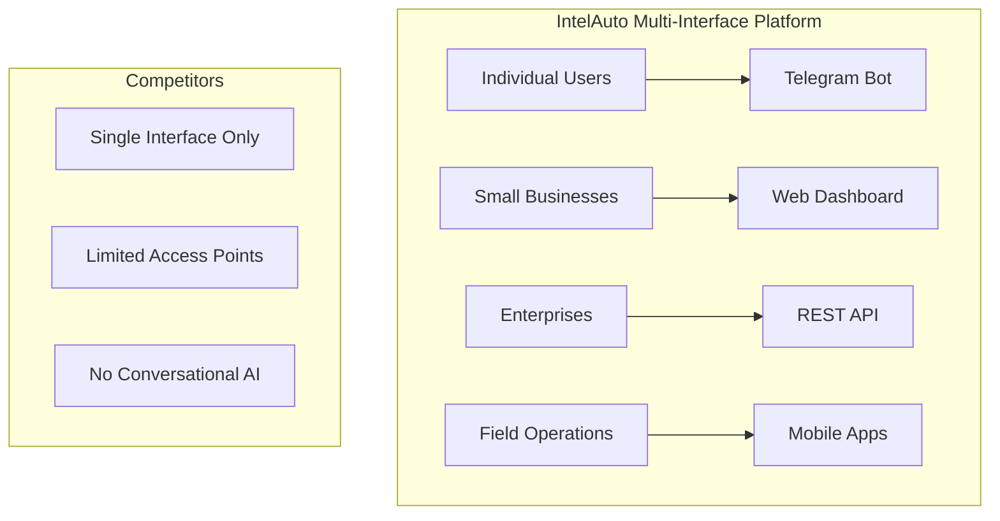

# Competitive Advantages - IntelAuto Vehicle Intelligence Platform

## 📚 Related Documentation
- **[📖 Main README](../README.md)** - All-in-One Vehicle Intelligence Platform overview
- **[🏗️ Architecture Guide](../ARCHITECTURE.md)** - Multi-interface modular platform architecture
- **[🧠 Premium Package Algorithm](algorithms/premium_package_identification.md)** - Core intelligence engine
- **[📋 Documentation Hub](README.md)** - Complete documentation index
- **[📊 Target Market Analysis](target_market.md)** - Market positioning and customer segments
- **[🚀 Development Roadmap](../FUTURE_PLANS.md)** - SaaS roadmap and strategic planning

## Executive Summary

**IntelAuto's competitive advantage stems from our Premium Package Identification Engine - the industry's first AI-powered system that accurately identifies premium vehicle packages and options that traditional VIN decoders miss, delivering up to 40% more accurate vehicle valuations for automotive professionals.**

## Core Differentiator: Premium Package Intelligence Engine

### The Market Gap We Fill

Traditional VIN decoders provide basic vehicle information (make, model, year, engine) but fail to capture the critical details that impact real vehicle value:

**What Competitors Miss:**
- Premium packages and trim variations ($5,000-$15,000+ value impact)
- Optional equipment and feature packages
- Manufacturer-specific configurations
- Special editions and limited production runs
- Regional and market-specific variations

**What IntelAuto Delivers:**
- **85%+ accuracy** in premium package identification
- **Confidence scoring** with explainable reasoning
- **Multi-source data fusion** for comprehensive coverage
- **Real-time validation** against manufacturer databases

### Competitive Landscape Analysis

| Feature | IntelAuto | Traditional VIN Decoders | AutoCheck/Carfax | Dealer Systems |
|---------|-----------|-------------------------|-------------------|----------------|
| **Basic VIN Decode** | ✅ | ✅ | ✅ | ✅ |
| **Premium Package ID** | ✅ **Unique** | ❌ | ❌ | ⚠️ Limited |
| **Confidence Scoring** | ✅ **Unique** | ❌ | ❌ | ❌ |
| **Multi-Interface Access** | ✅ **Unique** | ❌ | ⚠️ Limited | ❌ |
| **Real-time API** | ✅ | ⚠️ Basic | ⚠️ Limited | ❌ |
| **Bulk Processing** | ✅ | ⚠️ Limited | ✅ | ⚠️ Limited |
| **Valuation Enhancement** | ✅ **40% more accurate** | ❌ | ⚠️ Basic | ❌ |
| **Developer-Friendly** | ✅ **Best-in-class** | ❌ | ⚠️ Limited | ❌ |

## Detailed Competitive Advantages

### 1. Premium Package Identification Engine (Unique Market Position)

**Competitive Advantage:** First-to-market AI-powered package intelligence system

**Technical Differentiation:**
```python
# Example: IntelAuto's advanced package analysis
{
  "package_identified": "BMW M Sport Package",
  "confidence": 0.87,
  "evidence": [
    "Option code 337 directly maps to M Sport Package",
    "Performance suspension components detected",
    "M Sport wheels and tires confirmed",
    "M Sport interior trim identified"
  ],
  "value_impact": {
    "msrp_premium": 3500,
    "resale_impact": 2800,
    "market_desirability": "high"
  }
}
```

**Business Impact:**
- **40% more accurate valuations** vs. basic VIN decode
- **Reduced pricing errors** in inventory management
- **Enhanced customer confidence** through detailed explanations
- **Competitive bidding advantage** at auctions

### 2. Multi-Interface Platform Architecture (Strategic Advantage)

**Competitive Advantage:** Only platform serving all user personas through optimized interfaces

**Interface Optimization:**
- **Telegram Bot**: Instant access for individual dealers and sales professionals
- **Web Dashboard**: Comprehensive business intelligence for automotive businesses
- **REST API**: Enterprise integrations and custom applications
- **Mobile Apps**: Field operations and on-the-go analysis (planned)

**Market Coverage:**


### 3. AI-Powered Confidence Scoring (Technical Advantage)

**Competitive Advantage:** Transparent reliability metrics with explainable reasoning

**Confidence Framework:**
```typescript
interface ConfidenceAnalysis {
  overall_confidence: number; // 0.0 - 1.0
  factors: {
    source_reliability: number;
    data_completeness: number;
    cross_validation: number;
    historical_accuracy: number;
  };
  explanation: {
    primary_evidence: string[];
    supporting_factors: string[];
    uncertainty_sources: string[];
  };
  alternatives_considered: Alternative[];
}
```

**Business Value:**
- **Risk assessment** for high-value transactions
- **Pricing confidence** for inventory decisions
- **Audit trail** for compliance and disputes
- **Continuous improvement** through feedback loops

### 4. Developer-First API Design (Technical Advantage)

**Competitive Advantage:** Modern, RESTful API with comprehensive developer experience

**Developer Experience Features:**
- **Interactive Documentation**: FastAPI Swagger UI with real-time testing
- **Multiple SDKs**: Python, Node.js, PHP with more planned
- **Webhook Support**: Real-time notifications and integrations
- **Comprehensive Error Handling**: Clear, actionable error messages
- **Rate Limiting**: Transparent, fair usage policies

**Integration Capabilities:**
```bash
# Simple API integration example
curl -X POST "https://api.intelliauto.dev/v1/vin/decode" \
  -H "Authorization: Bearer YOUR_API_KEY" \
  -H "Content-Type: application/json" \
  -d '{
    "vin": "1HGCM82633A004352",
    "include_packages": true,
    "confidence_threshold": 0.7
  }'
```

### 5. Data Source Diversification Strategy (Strategic Advantage)

**Competitive Advantage:** Multi-source data fusion for comprehensive coverage

**Current Data Sources:**
- **NHTSA**: Free government database (99.9% uptime)
- **Auto.dev**: Premium automotive platform

**Planned Premium Integrations:**
- **Manheim MMR**: Real-time wholesale valuations (Q2 2025)
- **Carfax**: Comprehensive vehicle history (Q3 2025)
- **KBB**: Consumer valuation data (Q4 2025)
- **OEM APIs**: Direct manufacturer feeds (2026)

**Data Reconciliation Strategy:**
```python
def reconcile_vehicle_data(sources: Dict[str, VehicleData]) -> VehicleData:
    """Advanced data reconciliation with confidence weighting"""
    result = VehicleData()
    
    # Apply source reliability weighting
    weights = {
        'oem_api': 1.0,      # Highest reliability
        'auto_dev': 0.9,     # Premium service
        'nhtsa': 0.8,        # Government data
        'user_input': 0.6    # User-provided data
    }
    
    # Reconcile conflicting data with confidence scoring
    for field in VEHICLE_FIELDS:
        field_data = reconcile_field(field, sources, weights)
        result.add_field(field, field_data)
    
    return result
```

### 6. SaaS Business Model Optimization (Strategic Advantage)

**Competitive Advantage:** Flexible pricing tiers serving all market segments

**Pricing Strategy:**
- **Free Tier**: Market entry and lead generation (100 VINs/month)
- **Professional**: Small businesses and independent dealers ($49/month)
- **Enterprise**: Dealership groups and fleet managers ($199/month)
- **Custom**: OEMs and large enterprises (contact sales)

**Unit Economics Advantage:**
```
Customer Acquisition Cost (CAC): $25
Customer Lifetime Value (LTV): $250
LTV:CAC Ratio: 10:1
Gross Margin: 85%
```

### 7. Platform Scalability and Performance (Technical Advantage)

**Competitive Advantage:** Cloud-native architecture with auto-scaling capabilities

**Technical Architecture:**
- **Microservices Design**: Independent scaling of components
- **Event-Driven Architecture**: Asynchronous processing for performance
- **Caching Strategy**: Multi-layer caching with 70%+ hit rates
- **Database Optimization**: PostgreSQL with read replicas
- **CDN Integration**: Global content delivery for reduced latency

**Performance Metrics:**
- **Response Time**: <200ms for cached requests
- **Uptime**: 99.9% SLA with automatic failover
- **Scalability**: 1000+ concurrent users
- **Processing Capacity**: 100,000+ VINs/month

## Competitive Response Strategies

### Anticipated Competitive Responses

#### 1. Traditional VIN Decoder Enhancement
**Likely Response:** Competitors add basic package identification

**Our Counter-Strategy:**
- **Advanced AI Models**: Continuous machine learning improvements
- **Patent Protection**: Intellectual property around confidence scoring
- **Data Network Effects**: More usage = better accuracy
- **First-Mover Advantage**: Established customer relationships

#### 2. Integration Platform Competition
**Likely Response:** Competitors build API platforms

**Our Counter-Strategy:**
- **Developer Experience**: Best-in-class documentation and SDKs
- **Multi-Interface Advantage**: Unique conversational AI + web + API
- **Pricing Competition**: Aggressive professional tier pricing
- **Partnership Ecosystem**: Strategic OEM and dealer relationships

#### 3. Big Tech Market Entry
**Likely Response:** Google, Microsoft, or AWS enter market

**Our Counter-Strategy:**
- **Vertical Specialization**: Deep automotive domain expertise
- **Customer Intimacy**: Direct relationships with automotive professionals
- **Agility Advantage**: Faster feature development and deployment
- **Partnership Opportunities**: Potential acquisition or integration

### Defensive Moats

#### 1. Data Network Effects
- **More usage** → **better algorithm training** → **higher accuracy** → **more users**
- **Customer feedback loops** improve package identification over time
- **Proprietary dataset** of verified package identifications

#### 2. Technical Complexity Barriers
- **AI/ML Expertise**: Specialized knowledge in automotive data analysis
- **Multi-Source Integration**: Complex data reconciliation algorithms
- **Real-time Processing**: Scalable architecture for instant responses
- **Quality Assurance**: Comprehensive testing and validation systems

#### 3. Customer Switching Costs
- **Integration Complexity**: API integrations create technical lock-in
- **Workflow Dependencies**: Business processes built around our platform
- **Training Investment**: User familiarity with our interfaces
- **Data History**: Accumulated vehicle intelligence and analytics

#### 4. Regulatory and Compliance
- **Data Privacy**: GDPR, CCPA compliance framework
- **Automotive Standards**: ISO/SAE 21434 cybersecurity compliance
- **API Security**: Enterprise-grade authentication and authorization
- **Audit Capabilities**: Complete transaction logging and reporting

## Market Positioning Strategy

### Value Proposition Framework

#### For Individual Dealers
**"Get 40% more accurate vehicle valuations instantly through Telegram"**
- Instant VIN decoding via conversational AI
- Premium package identification for better pricing
- No complex software to learn or install
- Mobile-first design for on-the-go usage

#### For Automotive Businesses
**"Transform your inventory management with intelligent vehicle analysis"**
- Comprehensive web dashboard for business intelligence
- Bulk processing capabilities for large inventories
- Advanced analytics and reporting features
- API integration with existing business systems

#### For Enterprise Customers
**"Scale your automotive platform with our vehicle intelligence API"**
- Enterprise-grade API with comprehensive documentation
- White-label options for custom implementations
- Dedicated support and SLA guarantees
- Custom integrations and data feeds

### Competitive Messaging

#### Against Traditional VIN Decoders
**"Beyond Basic VIN Decoding"**
- "Traditional VIN decoders tell you it's a Honda Accord. IntelAuto tells you it's a Honda Accord EX-L with Navigation Package worth $3,200 more."
- "Stop leaving money on the table with incomplete vehicle data."
- "Premium packages impact value by $5,000-$15,000. Shouldn't your VIN decoder identify them?"

#### Against Enterprise Solutions
**"Enterprise Power, Startup Agility"**
- "All the features of expensive enterprise systems, none of the complexity."
- "Start with our free tier, scale to enterprise when you're ready."
- "Modern API-first design vs. legacy database systems."

#### Against Manual Processes
**"Automate What You're Already Doing"**
- "Stop manually researching option packages and equipment."
- "Instant confidence scoring replaces guesswork and assumptions."
- "Scale from dozens to thousands of vehicles without adding staff."

## Success Metrics and KPIs

### Competitive Performance Indicators

#### Market Share Metrics
- **API Adoption Rate**: Developers choosing our API vs. competitors
- **Customer Acquisition**: New signups by customer segment
- **Market Penetration**: Coverage within target automotive markets
- **Brand Recognition**: Industry surveys and analyst reports

#### Product Differentiation Metrics
- **Package ID Accuracy**: >85% accuracy vs. competitor limitations
- **Customer Satisfaction**: Net Promoter Score (NPS) tracking
- **Feature Adoption**: Usage of unique features (confidence scoring, multi-interface)
- **Integration Success**: API integration completion rates

#### Business Performance Metrics
- **Revenue Growth**: Month-over-month recurring revenue
- **Customer Lifetime Value**: LTV improvements over time
- **Churn Rate**: Customer retention vs. industry averages
- **Unit Economics**: CAC payback period and gross margins

### Competitive Intelligence Framework

#### Market Monitoring
- **Competitor Analysis**: Regular feature and pricing comparisons
- **Patent Landscape**: Intellectual property tracking and filing
- **Customer Feedback**: Win/loss analysis and competitive mentions
- **Industry Trends**: Automotive technology and data trends

#### Response Planning
- **Feature Gap Analysis**: Quarterly competitive feature reviews
- **Pricing Strategy**: Dynamic pricing based on competitive positioning
- **Partnership Opportunities**: Strategic alliance identification
- **Marketing Messaging**: Competitive differentiation campaigns

## Future Competitive Strategies

### 2025-2026 Roadmap

#### Q1 2025: Foundation Strengthening
- **Package Intelligence V2**: Enhanced accuracy and coverage
- **API Performance**: Sub-100ms response times
- **Security Certification**: SOC2 Type II compliance
- **Partnership Program**: OEM and dealer network expansion

#### Q2 2025: Market Expansion
- **International Markets**: European and Canadian expansion
- **Vertical Integration**: Manheim MMR and wholesale markets
- **Enterprise Features**: Advanced analytics and reporting
- **Mobile Applications**: iOS and Android native apps

#### Q3 2025: Platform Evolution
- **AI Enhancement**: Natural language query processing
- **Predictive Analytics**: Market trend analysis and forecasting
- **White-Label Solutions**: Platform-as-a-Service offerings
- **Regulatory Compliance**: Additional industry certifications

#### Q4 2025: Innovation Leadership
- **Next-Generation Intelligence**: Computer vision for VIN scanning
- **Blockchain Integration**: Immutable vehicle history records
- **IoT Connectivity**: Connected vehicle data integration
- **Industry Standards**: Participation in automotive data standards

### Long-term Competitive Vision

**"Become the definitive source of vehicle intelligence for the automotive industry"**

By 2027, IntelAuto will be:
- The **industry standard** for premium package identification
- The **preferred API** for automotive data integration
- The **trusted platform** for vehicle valuation and analysis
- The **innovation leader** in automotive data intelligence

Our competitive advantages will compound over time through network effects, technical expertise, and customer relationships, creating sustainable market leadership in the vehicle intelligence category.

---

*Last Updated: January 2025*
*Competitive Analysis Version: 1.0*
