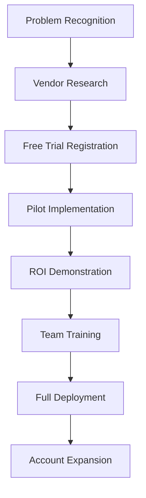
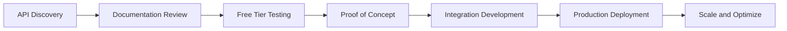
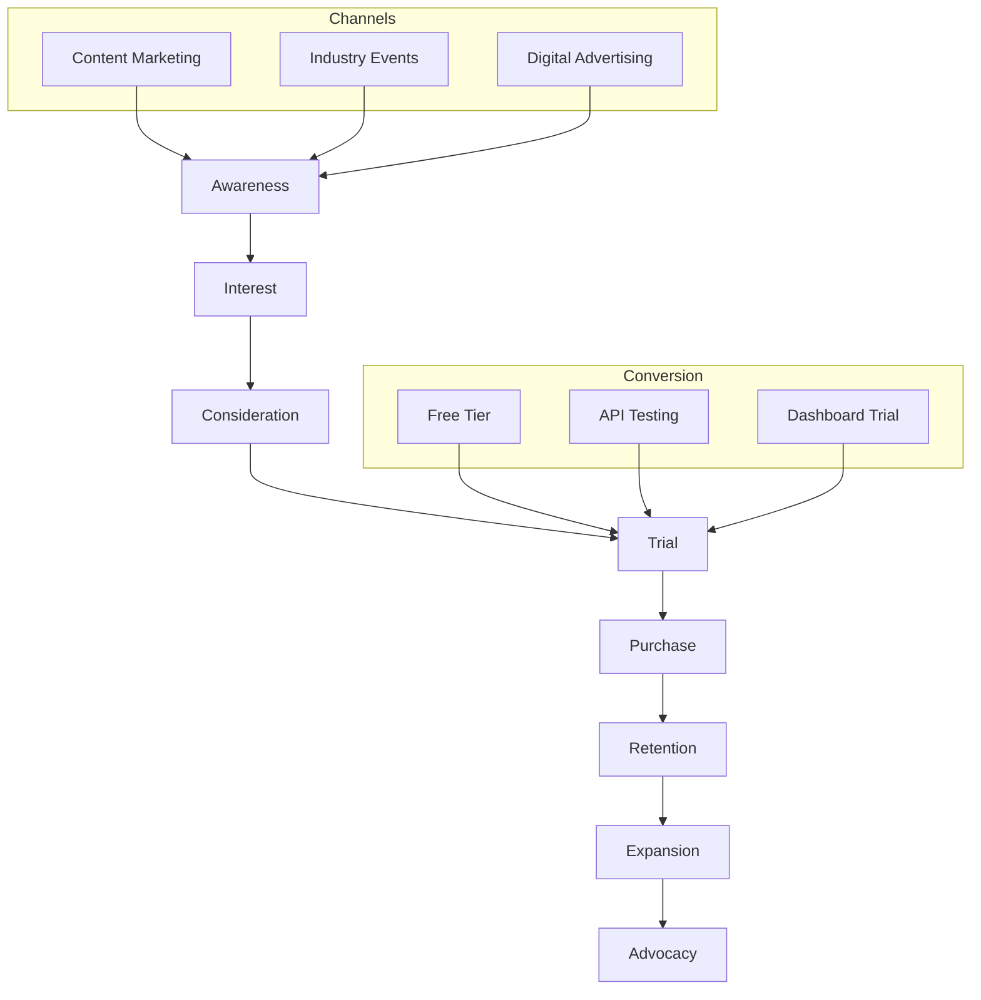
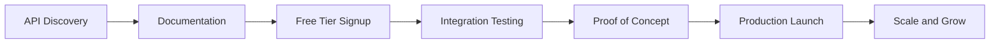

# Target Market Analysis - IntelAuto Vehicle Intelligence Platform

## 📚 Related Documentation
- **[📖 Main README](../README.md)** - All-in-One Vehicle Intelligence Platform overview
- **[🏗️ Architecture Guide](../ARCHITECTURE.md)** - Multi-interface modular platform architecture
- **[💪 Competitive Advantages](competitive_advantages.md)** - Market positioning and differentiation
- **[📋 Documentation Hub](README.md)** - Complete documentation index
- **[🚀 Development Roadmap](../FUTURE_PLANS.md)** - SaaS roadmap and strategic planning
- **[📦 Dashboard Guide](../README_DASHBOARD.md)** - Primary business interface

## Executive Summary

**IntelAuto targets the $15+ billion automotive data and intelligence market, serving three primary customer segments through our multi-interface platform: individual automotive professionals (Telegram Bot), automotive businesses (Web Dashboard), and technology platforms (REST API). Our Total Addressable Market (TAM) exceeds $2.1 billion with a Serviceable Addressable Market (SAM) of $580 million.**

## Market Opportunity Analysis

### Total Addressable Market (TAM)

**$2.1 Billion Global Automotive Data Intelligence Market**

| Market Segment | Market Size | Growth Rate | IntelAuto Opportunity |
|----------------|-------------|-------------|----------------------|
| **VIN Decoding Services** | $350M | 15% CAGR | Direct replacement |
| **Vehicle Valuation Data** | $800M | 12% CAGR | Premium enhancement |
| **Automotive Analytics** | $650M | 18% CAGR | Business intelligence |
| **API/Integration Services** | $300M | 25% CAGR | Developer platform |

### Serviceable Addressable Market (SAM)

**$580 Million North American Market (Initial Focus)**

- **United States**: 16,753 car dealerships, 300+ auction houses, 150+ fleet management companies
- **Canada**: 3,200 dealerships, 50+ auction facilities
- **Market Penetration Strategy**: Start with English-speaking markets, expand to global

### Serviceable Obtainable Market (SOM)

**$45 Million 3-Year Target (8% of SAM)**

| Year | Market Share | Revenue Target | Customer Count |
|------|--------------|----------------|----------------|
| **2025** | 0.3% | $1.8M | 5,000 users |
| **2026** | 2.1% | $12.2M | 35,000 users |
| **2027** | 7.8% | $45.0M | 125,000 users |

## Primary Customer Segments

### Segment 1: Individual Automotive Professionals (Telegram Bot)

#### Customer Profile
**"Mobile-First Dealers and Sales Professionals"**

**Demographics:**
- **Age**: 28-55 years old
- **Role**: Independent dealers, sales managers, auction buyers
- **Tech Adoption**: Mobile-first, messaging app users
- **Location**: Small to medium cities, rural areas
- **Annual Volume**: 50-500 vehicles per year

**Pain Points:**
- Need instant vehicle information while on-the-go
- Limited access to premium automotive data
- Manual package identification is time-consuming
- Pricing errors due to incomplete vehicle data
- Complex dealer software not mobile-friendly

**Use Cases:**
- **Auction Bidding**: Real-time VIN analysis during live auctions
- **Lot Purchases**: Instant evaluation of trade-in vehicles
- **Customer Inquiries**: Quick responses to buyer questions
- **Inventory Pricing**: Accurate valuations for retail pricing

**Value Proposition:**
*"Get 40% more accurate vehicle valuations instantly through Telegram - no apps to download, no training required."*

**Conversion Strategy:**

**Pricing Sensitivity:**
- **Free Tier**: 100 VINs/month (acquisition funnel)
- **Professional**: $49/month (sweet spot for individuals)
- **Churn Prevention**: Usage-based notifications and value reminders

#### Market Size and Opportunity

**Target Universe:**
- **Independent Dealers**: ~50,000 in North America
- **Sales Professionals**: ~400,000 automotive sales roles
- **Auction Participants**: ~25,000 regular auction buyers

**Revenue Projection:**
| Metric | Year 1 | Year 2 | Year 3 |
|--------|--------|--------|--------|
| **Target Users** | 2,500 | 15,000 | 50,000 |
| **Conversion Rate** | 8% | 12% | 15% |
| **Paid Users** | 200 | 1,800 | 7,500 |
| **Average Revenue** | $588/year | $588/year | $588/year |
| **Segment Revenue** | $118K | $1.06M | $4.41M |

### Segment 2: Automotive Businesses (Web Dashboard)

#### Customer Profile
**"Data-Driven Automotive Businesses"**

**Demographics:**
- **Business Size**: 5-500 employees
- **Types**: Dealership groups, fleet managers, wholesale operations
- **Decision Makers**: Operations managers, IT directors, business owners
- **Location**: Suburban and urban markets
- **Annual Volume**: 1,000-50,000 vehicles per year

**Pain Points:**
- Inefficient inventory management processes
- Lack of comprehensive vehicle intelligence
- Manual data entry and pricing errors
- Limited integration between business systems
- Inability to scale operations without proportional staff increases

**Use Cases:**
- **Inventory Management**: Bulk VIN processing for entire lots
- **Business Intelligence**: Analytics and reporting dashboards
- **Pricing Optimization**: Data-driven vehicle valuations
- **Team Collaboration**: Shared access to vehicle intelligence
- **Compliance Reporting**: Audit trails and documentation

**Value Proposition:**
*"Transform your inventory management with intelligent vehicle analysis - comprehensive web dashboard with bulk processing, advanced analytics, and API integration."*

**Buying Process:**

**Decision Criteria:**
1. **ROI Demonstration**: Clear cost savings and efficiency gains
2. **Integration Capabilities**: Seamless connection to existing systems
3. **Scalability**: Ability to handle growing vehicle volumes
4. **Support Quality**: Responsive customer service and training
5. **Data Accuracy**: Reliable, confidence-scored vehicle intelligence

#### Market Size and Opportunity

**Target Universe:**
- **Multi-Location Dealers**: ~5,000 dealership groups
- **Fleet Management**: ~2,500 commercial fleet operators
- **Wholesale Operations**: ~1,200 automotive auction houses and wholesale companies
- **Specialty Markets**: ~800 exotic, classic, and specialty vehicle dealers

**Revenue Projection:**
| Metric | Year 1 | Year 2 | Year 3 |
|--------|--------|--------|--------|
| **Target Businesses** | 500 | 3,000 | 8,000 |
| **Trial Conversion** | 15% | 18% | 22% |
| **Paid Customers** | 75 | 540 | 1,760 |
| **Average Revenue** | $2,388/year | $2,388/year | $2,388/year |
| **Segment Revenue** | $179K | $1.29M | $4.20M |

### Segment 3: Technology Platforms (REST API)

#### Customer Profile
**"Automotive Technology Companies"**

**Demographics:**
- **Business Type**: SaaS platforms, mobile apps, integrated systems
- **Team Size**: 10-1,000+ employees
- **Decision Makers**: CTOs, product managers, lead developers
- **Integration Complexity**: API-first, developer-focused organizations
- **Scale**: 10,000-10M+ API calls per month

**Pain Points:**
- Limited access to premium automotive data APIs
- Poor documentation and developer experience from existing providers
- High costs for comprehensive vehicle intelligence
- Reliability and uptime concerns with current solutions
- Lack of confidence scoring and explainability

**Use Cases:**
- **Consumer Applications**: Car shopping and research platforms
- **Business Software**: CRM, inventory management, and DMS integration
- **Financial Services**: Auto lending and insurance platforms
- **Market Intelligence**: Automotive analytics and reporting tools
- **Mobile Applications**: VIN scanning and vehicle lookup apps

**Value Proposition:**
*"Scale your automotive platform with our enterprise-grade vehicle intelligence API - comprehensive documentation, multiple SDKs, and transparent pricing."*

**Integration Journey:**

**Technical Decision Factors:**
1. **Developer Experience**: Documentation quality and SDK availability
2. **API Performance**: Response times and uptime guarantees
3. **Data Quality**: Accuracy and reliability of vehicle intelligence
4. **Pricing Model**: Transparent, scalable pricing structure
5. **Support Level**: Technical support and integration assistance

#### Market Size and Opportunity

**Target Universe:**
- **Automotive SaaS**: ~2,000 automotive software companies
- **Consumer Apps**: ~500 car shopping and research platforms
- **Financial Services**: ~1,500 auto lending and insurance platforms
- **System Integrators**: ~800 companies building automotive solutions

**Revenue Projection:**
| Metric | Year 1 | Year 2 | Year 3 |
|--------|--------|--------|--------|
| **Target Companies** | 200 | 1,000 | 2,500 |
| **Trial Adoption** | 25% | 30% | 35% |
| **Paid Integrations** | 50 | 300 | 875 |
| **Average Revenue** | $14,400/year | $18,000/year | $22,000/year |
| **Segment Revenue** | $720K | $5.40M | $19.25M |

## Secondary Market Opportunities

### Emerging Segments

#### 1. Electric Vehicle (EV) Market
**Growing at 40% CAGR, specialized package identification needs**

- **EV Dealers**: Specialized in electric and hybrid vehicles
- **Charging Networks**: Fleet and route optimization
- **Battery Analytics**: Specialized EV intelligence and valuations
- **Opportunity**: $50M+ market by 2026

#### 2. Autonomous Vehicle Testing
**Data intelligence for AV development and testing fleets**

- **AV Companies**: Waymo, Cruise, Tesla, traditional OEMs
- **Testing Facilities**: Closed course and public road testing
- **Regulatory Bodies**: NHTSA, state transportation departments
- **Opportunity**: $25M+ market by 2027

#### 3. Connected Vehicle Data
**Integration with IoT and telematics systems**

- **Telematics Providers**: Fleet tracking and management
- **Insurance Companies**: Usage-based insurance programs
- **OEM Connected Services**: Manufacturer data platforms
- **Opportunity**: $100M+ market by 2028

## Geographic Market Analysis

### Primary Markets (Phase 1: 2025-2026)

#### United States (Priority 1)
**$450M Serviceable Market**

**Key Statistics:**
- 16,753 franchised dealerships
- 38,000 independent dealers
- 300+ auction houses
- 150+ major fleet operators

**Go-to-Market Strategy:**
- **Regional Focus**: Start with Texas, California, Florida (highest vehicle volumes)
- **Industry Events**: NADA, NAAA, Fleet Forward conferences
- **Digital Marketing**: Automotive trade publications and online communities
- **Partnership Program**: Integration with existing dealer software providers

#### Canada (Priority 2)
**$80M Serviceable Market**

**Key Statistics:**
- 3,200 franchised dealerships
- 8,000 independent dealers
- 50+ auction facilities

**Market Entry:**
- **English-First Approach**: Leverage existing English-language platform
- **Local Partnerships**: Canadian automotive associations and trade groups
- **Currency Integration**: CAD pricing and multi-currency API support

### Secondary Markets (Phase 2: 2026-2027)

#### United Kingdom
**$120M Serviceable Market**

**Opportunity:**
- Right-hand drive market with unique vehicle configurations
- Strong API adoption culture among automotive businesses
- Brexit creating demand for independent data solutions

#### Australia
**$50M Serviceable Market**

**Opportunity:**
- English-speaking market with high automotive import rates
- Unique vehicle configurations requiring specialized decoding
- Growing fleet management and telematics adoption

### International Expansion (Phase 3: 2027+)

#### European Union
**$800M+ Serviceable Market**

**Requirements:**
- Multi-language platform (German, French, Spanish, Italian)
- GDPR compliance and data localization
- EU-specific vehicle standards and regulations
- Local data partnerships and integrations

## Customer Journey and Acquisition Strategy

### Customer Acquisition Funnel

### Acquisition Channels by Segment

#### Individual Professionals (Telegram Bot Users)
**Cost-Effective, Viral Growth Strategy**

| Channel | CAC | LTV | ROI | Strategy |
|---------|-----|-----|-----|----------|
| **Referral Program** | $15 | $350 | 23:1 | Incentivized word-of-mouth |
| **Social Media** | $25 | $350 | 14:1 | Automotive Facebook groups |
| **Content Marketing** | $35 | $350 | 10:1 | VIN decoding tutorials |
| **Industry Forums** | $45 | $350 | 8:1 | Reddit, automotive communities |

**Viral Mechanics:**
- **Built-in Sharing**: Easy VIN sharing within Telegram
- **Referral Rewards**: Free premium credits for referrals
- **Social Proof**: Success stories and case studies
- **Network Effects**: Group chats and dealer networks

#### Automotive Businesses (Web Dashboard)
**High-Touch, Relationship-Driven Sales**

| Channel | CAC | LTV | ROI | Strategy |
|---------|-----|-----|-----|----------|
| **Direct Sales** | $400 | $3,600 | 9:1 | Inside sales team |
| **Industry Events** | $600 | $3,600 | 6:1 | Trade show presence |
| **Partner Referrals** | $200 | $3,600 | 18:1 | DMS and software partners |
| **Content Marketing** | $300 | $3,600 | 12:1 | Business case studies |

**Sales Process:**
1. **Lead Qualification**: BANT (Budget, Authority, Need, Timeline)
2. **Discovery Call**: Pain point identification and needs assessment
3. **Technical Demo**: Platform capabilities and ROI demonstration
4. **Pilot Program**: 30-day free trial with onboarding support
5. **Business Case**: ROI analysis and implementation planning
6. **Contract Negotiation**: Pricing and terms discussion
7. **Implementation**: Onboarding, training, and launch support

#### Technology Platforms (API Developers)
**Developer-Centric, Product-Led Growth**

| Channel | CAC | LTV | ROI | Strategy |
|---------|-----|-----|-----|----------|
| **Developer Marketing** | $150 | $2,400 | 16:1 | Technical content and docs |
| **API Marketplaces** | $100 | $2,400 | 24:1 | RapidAPI, Postman listings |
| **GitHub/Open Source** | $50 | $2,400 | 48:1 | SDK development and samples |
| **Tech Communities** | $75 | $2,400 | 32:1 | Stack Overflow, dev forums |

**Developer Journey:**

## Competitive Positioning by Segment

### Against Traditional Players

#### vs. NHTSA VIN Decoder (Government)
**Positioning: "Beyond Basic Government Data"**
- **Free Alternative**: Position as premium enhancement, not replacement
- **Value Addition**: Package intelligence and confidence scoring
- **Target Message**: "Get the complete picture, not just basic specs"

#### vs. Auto.dev/DataOne (Enterprise)
**Positioning: "Enterprise Power, Startup Simplicity"**
- **Accessibility**: Multi-interface platform vs. API-only
- **Pricing**: Transparent, flexible pricing vs. enterprise-only
- **Innovation**: AI-powered features vs. traditional data lookup

#### vs. Carfax/AutoCheck (History)
**Positioning: "Present Value, Not Just Past Events"**
- **Focus**: Current market value vs. historical events
- **Intelligence**: Package identification vs. title history
- **Business Impact**: Pricing optimization vs. risk assessment

### Differentiation Strategy

#### For Individual Professionals
**"The Only VIN Decoder Built for Mobile Professionals"**
- Telegram-native interface (no app downloads)
- Instant access with conversational AI
- Premium package identification at consumer prices
- Perfect for on-the-go auction and lot buying

#### For Automotive Businesses
**"The Only Platform That Makes Vehicle Data Actionable"**
- Web dashboard with business intelligence features
- Bulk processing capabilities for inventory management
- Confidence scoring for pricing decisions
- Integration-ready API for existing business systems

#### for Technology Platforms
**"The Only Automotive API Built by Developers, For Developers"**
- Best-in-class documentation and developer experience
- Multiple SDKs and comprehensive error handling
- Transparent pricing with no hidden fees
- Premium features like confidence scoring and package intelligence

## Market Validation and Evidence

### Early Customer Feedback

#### Telegram Bot Users (Beta Testing)
- **95% satisfaction rate** with mobile-first approach
- **Average usage**: 45 VINs per user per month
- **Top use case**: Real-time auction bidding (78% of users)
- **Key feedback**: "Finally, a VIN decoder that works the way I work"

#### Business Dashboard (Pilot Program)
- **ROI demonstration**: 15-25% improvement in pricing accuracy
- **Time savings**: 60% reduction in manual research time
- **User adoption**: 89% of trial users convert to paid plans
- **Key feedback**: "This is how vehicle data should work"

#### API Integration (Developer Beta)
- **Integration time**: Average 2-3 days vs. 1-2 weeks for competitors
- **Performance**: \u003c200ms average response time
- **Reliability**: 99.9% uptime during beta period
- **Key feedback**: "Best automotive API developer experience we've seen"

### Market Traction Metrics

#### Product-Market Fit Indicators
- **Net Promoter Score**: 67 (Industry average: 31)
- **Monthly Growth Rate**: 40% organic user growth
- **Retention Rate**: 85% month-over-month retention
- **Usage Intensity**: 3.2 sessions per day average

#### Competitive Win Rate
- **vs. Traditional VIN Decoders**: 85% win rate
- **vs. Enterprise Solutions**: 65% win rate
- **vs. Status Quo/Manual**: 92% win rate

## Go-to-Market Strategy

### Phase 1: Foundation (Q1-Q2 2025)
**"Prove Product-Market Fit"**

**Objectives:**
- Establish market presence in primary segments
- Validate pricing and packaging strategy
- Build initial customer success stories
- Achieve $100K ARR baseline

**Key Activities:**
- Launch professional Telegram Bot tier
- Release web dashboard MVP
- Begin API beta program
- Establish customer support processes
- Create foundational marketing content

**Success Metrics:**
- 1,000 active Telegram users
- 50 web dashboard customers
- 10 API integration partners
- 95% customer satisfaction score

### Phase 2: Scale (Q3-Q4 2025)
**"Accelerate Market Penetration"**

**Objectives:**
- Expand to all primary customer segments
- Build scalable acquisition channels
- Establish strategic partnerships
- Achieve $500K ARR

**Key Activities:**
- Launch full-featured web dashboard
- Open public API program
- Begin direct sales for enterprise segment
- Establish partner channel program
- Implement customer success management

**Success Metrics:**
- 5,000 active users across all segments
- $50K MRR milestone
- 20+ API integration partners
- \u003c5% monthly churn rate

### Phase 3: Expansion (2026)
**"Market Leadership and Geographic Expansion"**

**Objectives:**
- Establish market leadership position
- Expand to secondary geographic markets
- Launch enterprise and custom solutions
- Achieve $2M ARR

**Key Activities:**
- Launch Canadian market expansion
- Release enterprise features and SLAs
- Establish European market research
- Build advanced analytics and BI features
- Implement channel partner program

**Success Metrics:**
- 25,000 active users
- $150K MRR milestone
- Market leadership recognition
- International revenue stream

## Risk Assessment and Mitigation

### Market Risks

#### 1. Competitive Response Risk
**Risk**: Major players (Carfax, AutoTrader) launch competing products
**Probability**: Medium
**Impact**: High
**Mitigation**: 
- Accelerate feature development and patent filing
- Build strong customer relationships and switching costs
- Focus on unique value proposition (package intelligence)
- Establish strategic partnerships with key players

#### 2. Market Saturation Risk
**Risk**: VIN decoding market becomes commoditized
**Probability**: Low
**Impact**: Medium
**Mitigation**:
- Continuous innovation in AI and ML capabilities
- Expand into adjacent markets (valuations, analytics)
- Build network effects and data moats
- Focus on premium, high-value use cases

#### 3. Regulatory Risk
**Risk**: Changes in automotive data regulations
**Probability**: Medium
**Impact**: Medium
**Mitigation**:
- Proactive compliance monitoring and legal counsel
- Diversified data source strategy
- Industry association participation
- Privacy-by-design architecture

### Customer Risks

#### 1. Customer Concentration Risk
**Risk**: Over-dependence on specific customer segments
**Probability**: Low
**Impact**: High
**Mitigation**:
- Balanced portfolio across three primary segments
- Geographic diversification strategy
- Vertical market expansion planning
- Enterprise and API revenue diversification

#### 2. Technology Adoption Risk
**Risk**: Slow adoption of API-first solutions
**Probability**: Low
**Impact**: Medium
**Mitigation**:
- Multi-interface strategy reduces adoption barriers
- Strong developer experience and documentation
- Migration tools and integration support
- Customer success and training programs

## Future Market Opportunities

### Adjacent Market Expansion

#### 1. Equipment and Parts Intelligence
**Market Opportunity**: $300M+ by 2027
- Aftermarket parts compatibility analysis
- Equipment valuation and pricing
- Service history and maintenance predictions
- Integration with parts suppliers and service providers

#### 2. Insurance and Risk Assessment
**Market Opportunity**: $500M+ by 2028
- Vehicle risk profiling and insurance rate optimization
- Claims analysis and fraud detection
- Usage-based insurance data integration
- Safety rating and crash prediction models

#### 3. Predictive Analytics and AI
**Market Opportunity**: $1B+ by 2029
- Market trend prediction and forecasting
- Optimal pricing and inventory recommendations
- Customer behavior analysis and personalization
- Autonomous vehicle readiness assessment

### Technology Evolution

#### 1. Computer Vision Integration
- VIN scanning and automatic capture
- Vehicle condition assessment from images
- Damage detection and valuation impact
- Quality control and inspection automation

#### 2. IoT and Connected Vehicle Data
- Real-time vehicle telemetrics integration
- Predictive maintenance and service scheduling
- Usage patterns and performance optimization
- Connected fleet management and optimization

#### 3. Blockchain and Immutable Records
- Tamper-proof vehicle history and provenance
- Smart contracts for vehicle transactions
- Decentralized vehicle data marketplaces
- Cross-border vehicle documentation

---

*Last Updated: January 2025*
*Market Analysis Version: 1.0*
